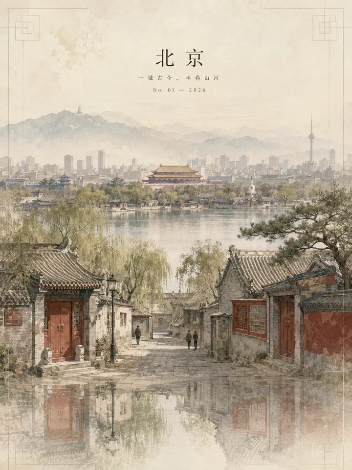
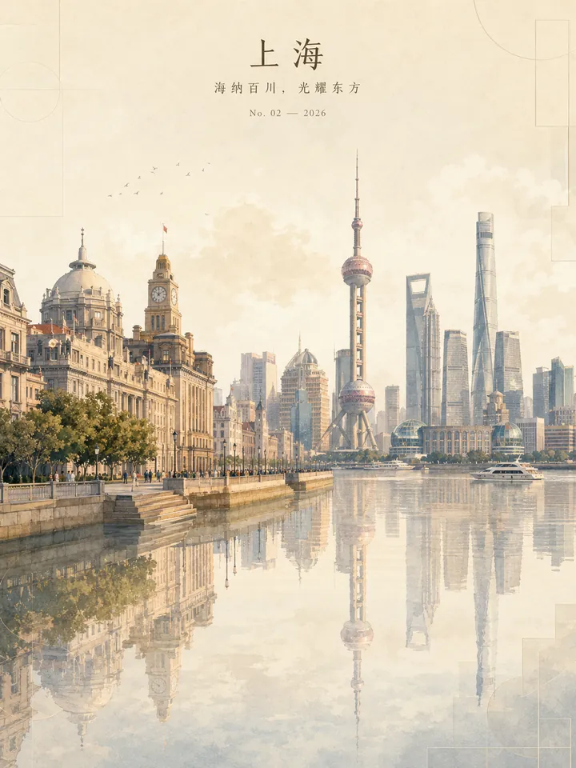
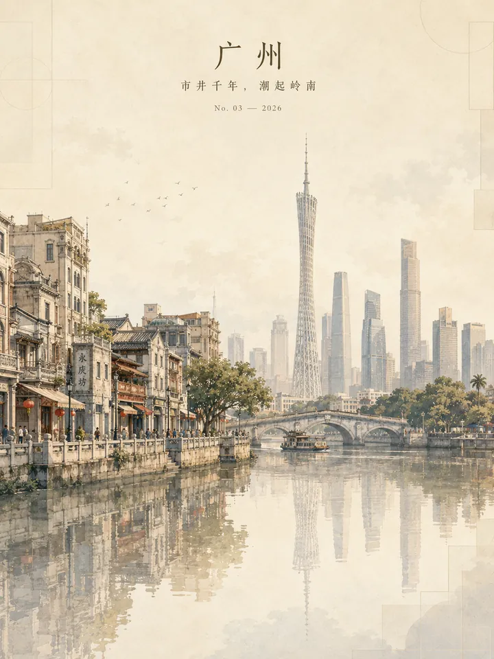
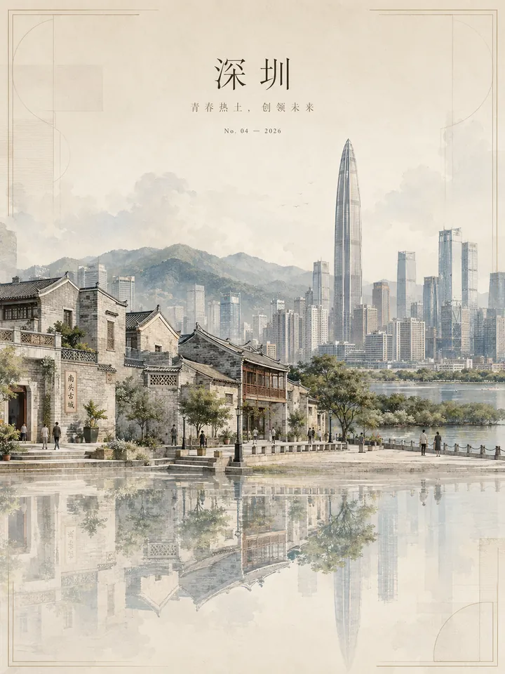
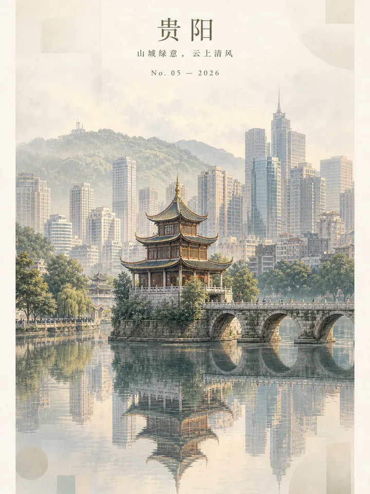
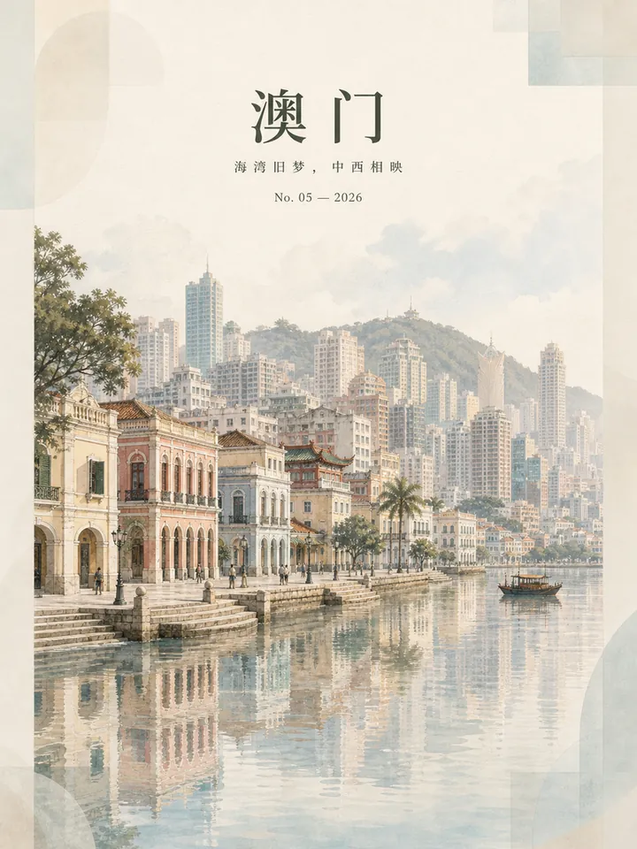

# MichengAI City Reflection Travel Print

**中文** · [English](./README.en.md) · [返回仓库首页](../README.md)

根据城市生成可收藏的当代旅行艺术印刷品：城市真实的景观、建筑与文化环境融为一体，置于柔和的镜面倒影上，并配以克制的杂志排版。

## 输入

| 参数 | 是否必填 | 规则 |
| --- | --- | --- |
| `city` | 是 | 城市是画面核心和顶部标题。未提供时会先询问。 |
| `size` | 否 | 支持比例或像素尺寸；未提供时请求 `3:4`。工具支持明确像素时，默认请求 `768×1024`。 |
| `country` | 否 | 未提供时由城市可靠判断；城市有歧义时会先确认。 |
| `slogan` | 否 | 未提供时根据真实城市特征生成；提供后逐字使用。 |

## 视觉特征

- 以城市真实的地貌、滨水、街区和建筑语言建立一个连续环境，而非地标拼贴。
- 高级低饱和配色、水彩与水粉纸感、细腻建筑线稿和现代数字插画控制。
- 平静的玻璃感反射面，带柔和、略微褪色的垂直倒影。
- 极轻微的半透明几何边缘，营造当代画廊艺术感。
- 顶部只使用城市名、标语和 `No. 05 — 年份` 三项小号杂志文字；建筑与环境中不生成未指定文字。
- 直接在图像生成请求中指定比例或像素尺寸；不依赖 Python、脚本或后期裁切、补边、缩放来改变构图。

## 使用

```text
使用名为 `michengai-city-reflection-travel-print` 的 Skill 生成城市旅行艺术印刷品。
城市：香港
国家：中国
尺寸：3:4
标语：一城烟火，两岸风华
```

只提供必填参数：

```text
使用名为 `michengai-city-reflection-travel-print` 的 Skill 生成一张城市旅行艺术印刷品。
城市：里斯本
```

## 演示

| <strong>北京・一城古今，半卷山河</strong><br> | <strong>上海・海纳百川，光耀东方</strong><br> |
| :--- | :--- |
| <strong>广州・市井千年，潮起岭南</strong><br> | <strong>深圳・青春热土，创领未来</strong><br> |
| <strong>贵阳・山城绿意，云上清风</strong><br> | <strong>澳门・海湾旧梦，中西相映</strong><br> |

## 文件

- [`SKILL.md`](./SKILL.md)：参数规则、城市选择逻辑与视觉约束。
- [`references/prompt-template.md`](./references/prompt-template.md)：城市专属生成提示词模板。
- [`agents/openai.yaml`](./agents/openai.yaml)：可选的 OpenAI/Codex 集成元数据和默认提示；核心 Skill 可独立使用。
