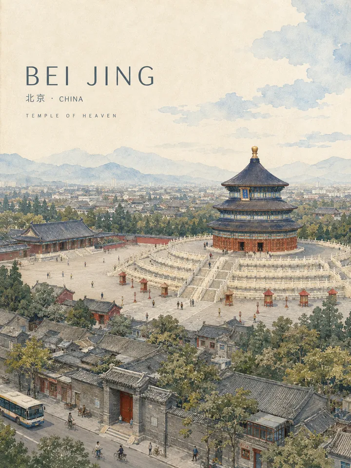
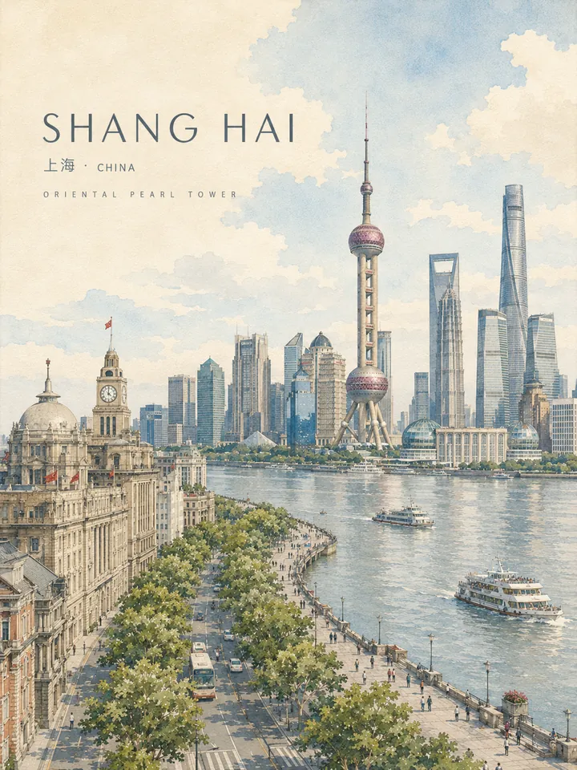
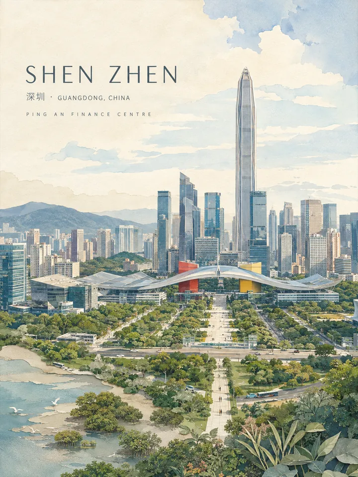
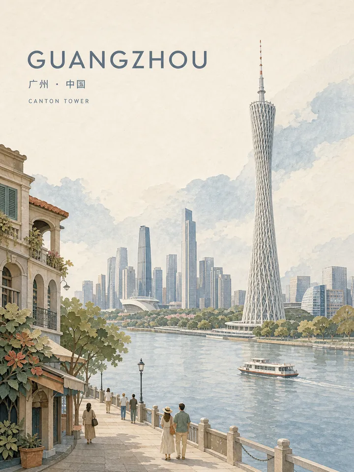

# MichengAI City Travel Postcard

**中文** · [English](./README.en.md) · [返回仓库首页](../README.md)

根据指定城市生成高级日式旅游杂志风插画明信片：以真实地标和在地环境为核心，融合分层纸张拼贴、水粉、水彩和克制的多语编辑排版。

## 输入

| 参数 | 是否必填 | 规则 |
| --- | --- | --- |
| `city` | 是 | 决定地标、当地名称、国家/地区、环境与画面文字。信息不明确时会先确认。 |
| `size` | 否 | 支持比例或图像工具支持的像素尺寸；未提供时请求 `3:4`。 |
| `country_or_region` | 否 | 未提供时仅在可可靠判断时推断；有歧义时先询问。 |
| `language` | 否 | 控制说明语言；画面内当地名称始终使用当地通行书写形式。 |

## 特征

- 自动建立城市事实画像，选择一个地理位置准确的主地标。
- 让在地建筑、道路、自然环境、交通与少量人物共享一个可信视角，拒绝地标拼贴。
- 固定为安静、精致的日式旅游杂志插画气质：纸张拼贴、水粉、水彩、哑光纸感与轻微手工切边。
- 顶部只渲染城市名、当地名称与国家/地区、主地标名三行文字。
- 纯提示词流程：直接请求比例或像素；不依赖 Python、脚本或生成后的裁切、补边、缩放。

## 使用

```text
使用 $michengai-city-travel-postcard 生成城市插画明信片。
城市：上海
尺寸：3:4
```

```text
使用 $michengai-city-travel-postcard 生成城市插画明信片。
城市：深圳
尺寸：1080×1350
```

## 演示

以下 4 个实测结果均压缩为 **720 × 960 WebP**，并以 320px 宽双列展示；标题与图片放在同一单元格中，确保 GitHub 页面对应稳定。

|  |  |
| --- | --- |
| <strong>北京・天坛</strong><br> | <strong>上海・东方明珠</strong><br> |
| <strong>深圳・平安金融中心</strong><br> | <strong>广州・广州塔</strong><br> |

## 文件

- [`SKILL.md`](./SKILL.md)：参数、城市事实规则、视觉约束与验证标准。
- [`references/prompt-template.md`](./references/prompt-template.md)：城市专属生成提示词模板。
- [`agents/openai.yaml`](./agents/openai.yaml)：Codex 展示名称和默认调用提示。
