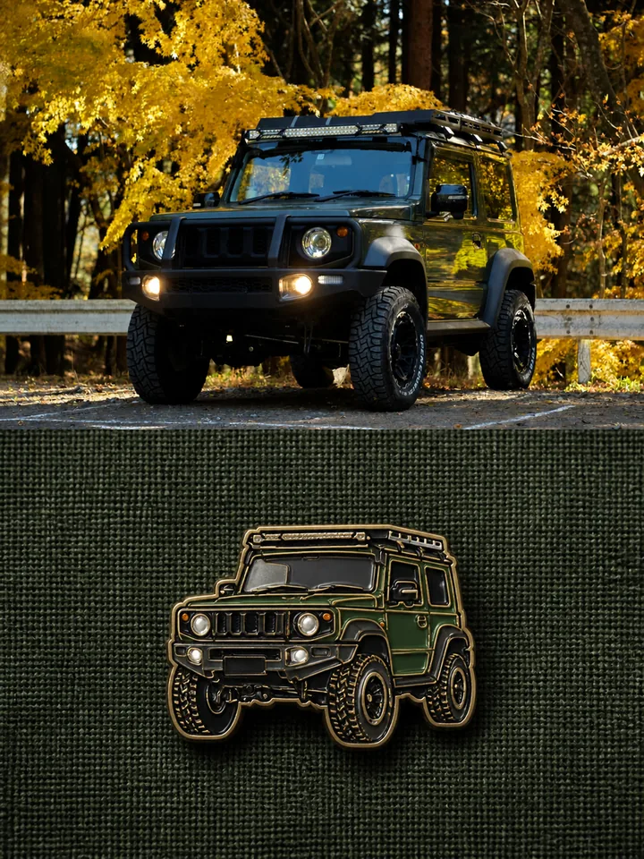
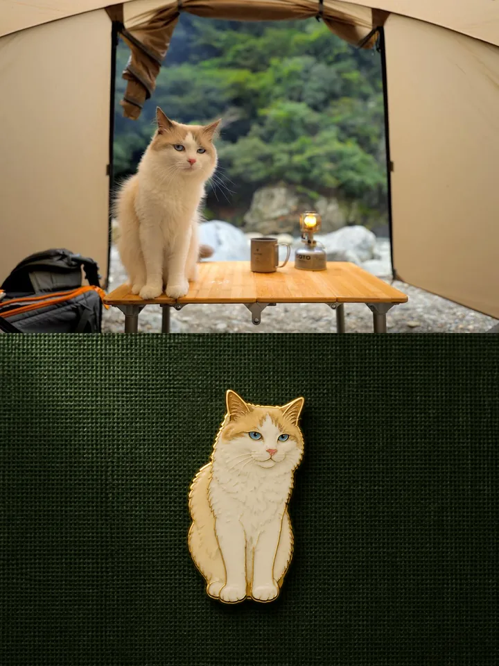
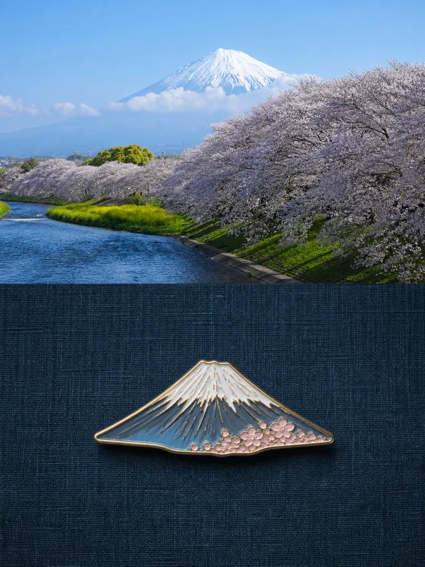
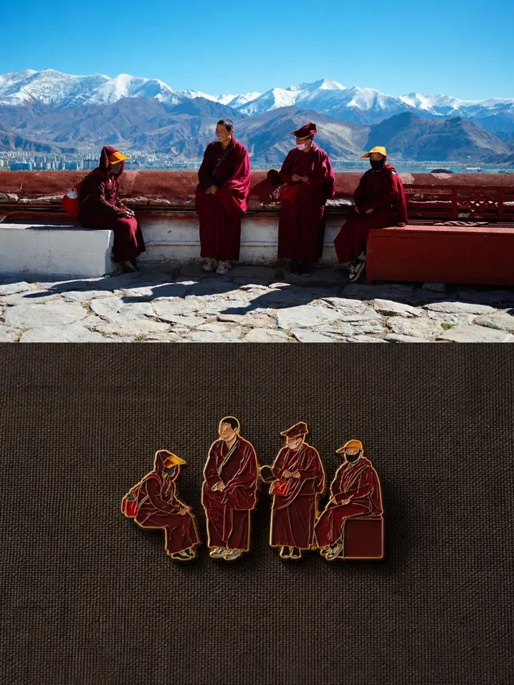
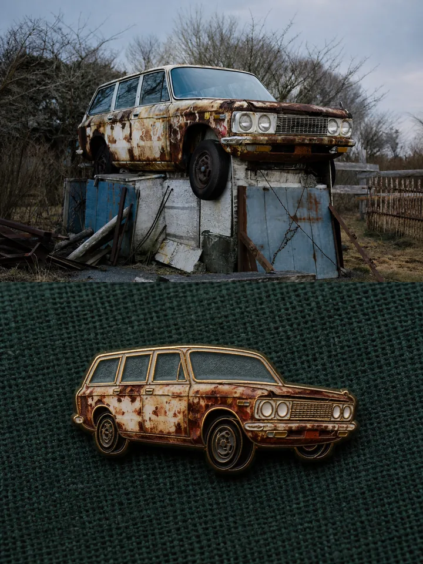
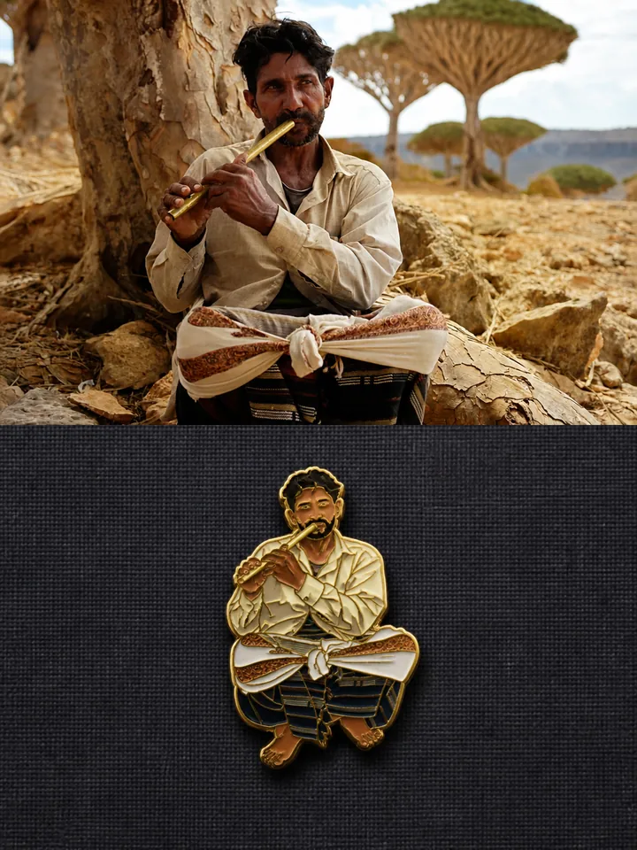
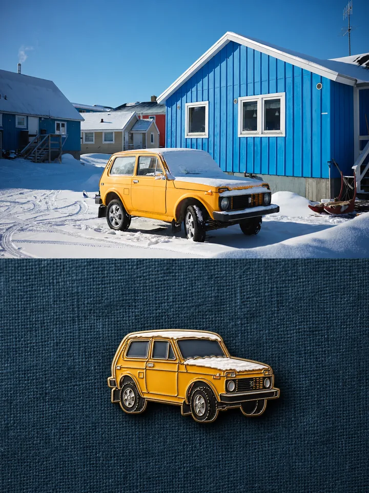
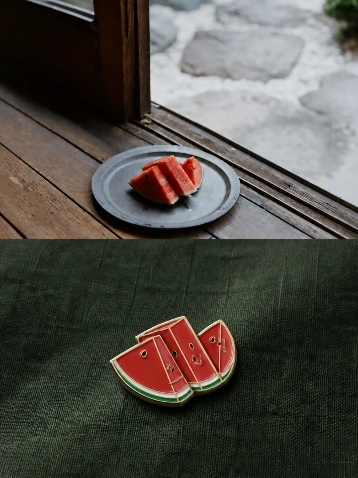

# MichengAI Photo Enamel Travel Badge

[中文](./README.md) · **English** · [Back to repository](../README.en.md)

Extracts the most recognizable subject from an uploaded photo, simplifies its defining silhouette into a physical travel souvenir badge with gold metal edging, shallow relief, and enamel fills, then pairs it with the original photo in a `3:4` portrait composition.

## Demos

| <strong>Autumn Off-Road Vehicle</strong><br> | <strong>Camping Cat</strong><br> |
| :--- | :--- |
| <strong>Mount Fuji and Cherry Blossoms</strong><br> | <strong>Four People in the Mountains</strong><br> |
| <strong>Rusted Car in the Wild</strong><br> | <strong>Seated Flutist</strong><br> |
| <strong>Off-Road Vehicle in Snow</strong><br> | <strong>Watermelon by the Window</strong><br> |

## Visual structure

1. **Original photo above:** a `3:2` landscape panel preserving the subject, composition, light, color, and photographic character.
2. **Badge display below:** a `3:2` landscape panel of dark, coarse burlap with one badge slightly above center. Its overall visual mass occupies roughly `25%–30%` of the panel, adapting to the subject's natural proportions while retaining generous negative space.
3. **Overall canvas:** two equal-height `3:2` panels stacked into a strict `3:4` portrait output.

## Badge craft

- Follows the natural silhouette of the source subject instead of defaulting to a circular or shield-shaped base.
- Preserves the outer contour, defining negative spaces, and the most recognizable internal features while removing fine texture and the complete background.
- Uses continuous warm-gold metal edging, restrained shallow relief, and a small source-derived enamel palette.
- Combines an upper-left key highlight, soft lower-right fill light, and a natural contact shadow to communicate physical thickness.
- Derives a harmonious dark background color from the photo and renders it as low-reflectance coarse burlap.

## Boundaries

- Processes multiple photos separately and returns one output per photo without making a collage.
- Places exactly one complete badge in the lower panel and adds no text, maps, aircraft, compasses, or generic travel symbols.
- Avoids flat stickers, white die-cut borders, 2D vector graphics, full-bleed scenes, cartoons, domed resin, toy-like plastic, and realistic environmental props.
- When the source is not `3:2`, uses a subject-safe crop first; if cropping would damage the subject, extends source-matched edges without stretching.
- Produces the finished composition with an image editing or generation tool instead of returning only a prompt.

## Usage

```text
Use the `michengai-photo-enamel-travel-badge` skill to turn this photo into a 3:4 enamel travel badge composition.
```

For multiple photos:

```text
Use the `michengai-photo-enamel-travel-badge` skill on each uploaded photo. Return one separate result per photo and do not create a collage.
```

## Files

- [`SKILL.md`](./SKILL.md): input rules, subject extraction, layout, badge craft, and validation requirements.
- [`references/prompt-template.md`](./references/prompt-template.md): Chinese image-generation template customized for each source photo.
- [`agents/openai.yaml`](./agents/openai.yaml): optional OpenAI/Codex display metadata and default prompt; the core skill works independently.
- [`assets/demo/`](./assets/demo/): eight `720×960` WebP output demos.
