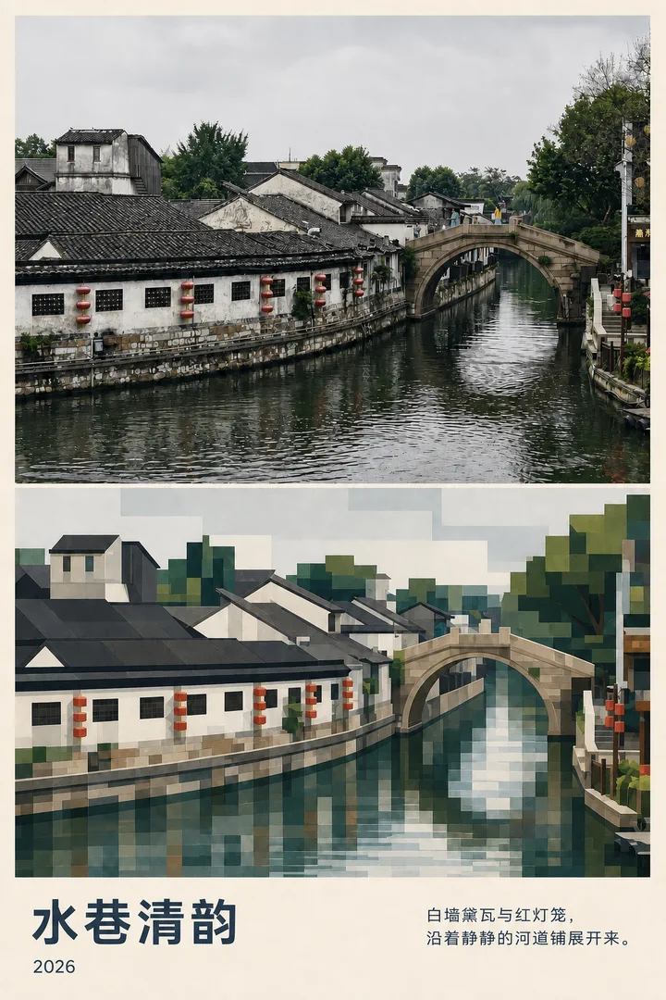
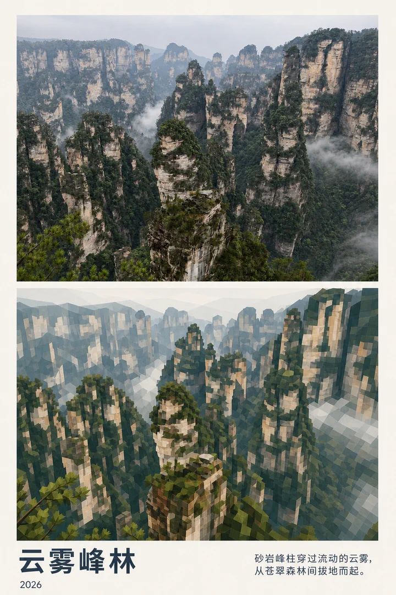
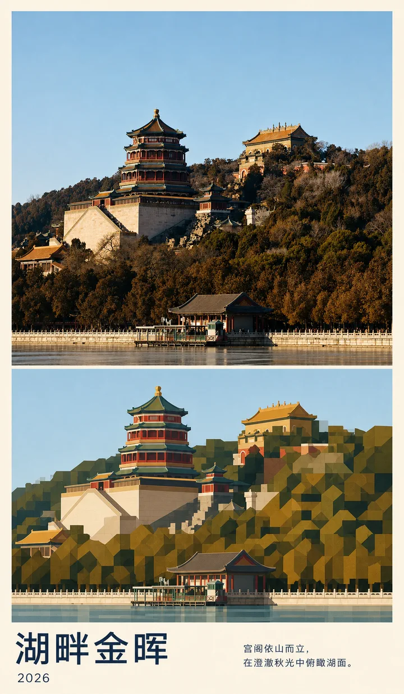

# MichengAI Photo Geometry Poster

[中文](./README.md) · **English** · [Back to repository](../README.en.md)

Transforms an uploaded reference photo into a premium portrait editorial poster. The upper panel remains realistic photography, the lower panel geometrically reinterprets the same composition and perspective, and the footer adds restrained title, subtitle, and year typography.

## Demos

### Canal Rhythms

<p align="center"></p>

### Mountains in Mist

<p align="center"></p>

### Lakeside Golden Light

<p align="center"></p>

## Visual structure

1. **Realistic photography** preserves the reference subject, framing, viewpoint, perspective, horizon, palette, and recognizable silhouettes.
2. **Geometric reinterpretation** rebuilds the same scene with clean rectangular and polygonal forms while retaining spatial relationships and hierarchy.
3. **Editorial typography** presents a title, subtitle, and year in a restrained architecture, travel, or city-culture magazine layout.

## Features

- Works with city, architecture, landscape, and travel photography.
- Supports Chinese and English titles and subtitles.
- Follows the requested language, or the current conversation language when none is specified.
- Uses 4–10 Chinese characters or 2–5 English words for generated titles.
- Does not intentionally add extra copy, logos, watermarks, or unrelated objects.
- Produces the finished image with an image editing/generation tool instead of returning only a prompt.

## Usage

```text
Use $michengai-photo-geometry-poster to turn my uploaded photo into a premium editorial poster.
```

With specified copy:

```text
Use $michengai-photo-geometry-poster on this photo.
Render the title "MOUNTAINS IN MIST", the subtitle "Sandstone pillars rise through drifting mist above the forest.", and the year "2026".
```

## Files

- [`SKILL.md`](./SKILL.md): workflow, visual constraints, and copy rules.
- [`references/prompt-template.md`](./references/prompt-template.md): adaptive image-generation template.
- [`agents/openai.yaml`](./agents/openai.yaml): Codex display metadata and default invocation.
- [`assets/demo/`](./assets/demo/): generated output demos.
