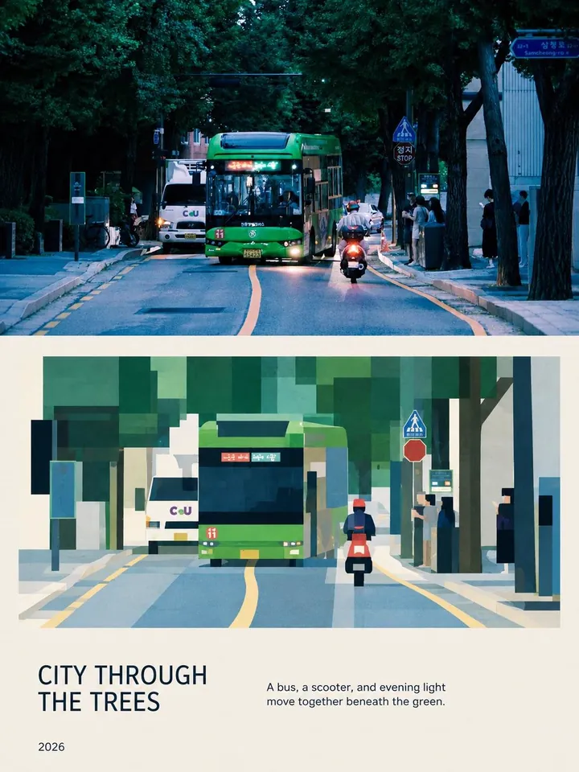

# MichengAI Photo Geometry Poster

**中文** · [English](./README.en.md) · [返回仓库首页](../README.md)

将上传的参考照片重制为高级竖版编辑海报：上半部保持写实摄影，下半部以同一构图和透视进行几何块面转译，底部加入克制的标题、副标题与年份。

## 演示

| <strong>水巷清韵</strong><br> | <strong>云雾峰林</strong><br> |
| :--- | :--- |
| <strong>湖畔金晖</strong><br> | <strong>林荫穿城</strong><br> |

## 视觉结构

1. **写实摄影区**：保留参考照片的主体、取景、视角、透视、地平线、主色和标志性轮廓。
2. **几何转译区**：使用干净的大矩形与多边形重构同一场景，保持对应的空间关系、比例和视觉层级。
3. **编辑排版区**：使用现代无衬线字体呈现标题、副标题和年份，整体接近建筑、旅行或城市文化杂志。

## 特性

- 适用于城市、建筑、自然风景与旅行照片。
- 支持中文和英文标题、副标题。
- 未指定语言时跟随当前对话语言；中文请求默认生成中文文案。
- 中文标题使用 4–10 个汉字，英文标题使用 2–5 个单词。
- 不主动添加额外文字、Logo、水印或无关物体。
- 直接调用图片编辑/生成工具产出成品，而不是只返回提示词。

## 使用

```text
使用 $michengai-photo-geometry-poster 把这张照片处理成中文编辑海报。
```

指定文案：

```text
使用 $michengai-photo-geometry-poster 处理这张照片。
标题使用“湖畔金晖”，副标题使用“宫阁依山而立，在澄澈秋光中俯瞰湖面。”，年份使用 2026。
```

## 文件

- [`SKILL.md`](./SKILL.md)：执行流程、视觉约束和文案规则。
- [`references/prompt-template.md`](./references/prompt-template.md)：自适应图片生成模板。
- [`agents/openai.yaml`](./agents/openai.yaml)：Codex 展示名称和默认调用提示。
- [`assets/demo/`](./assets/demo/)：实际生成效果演示。
