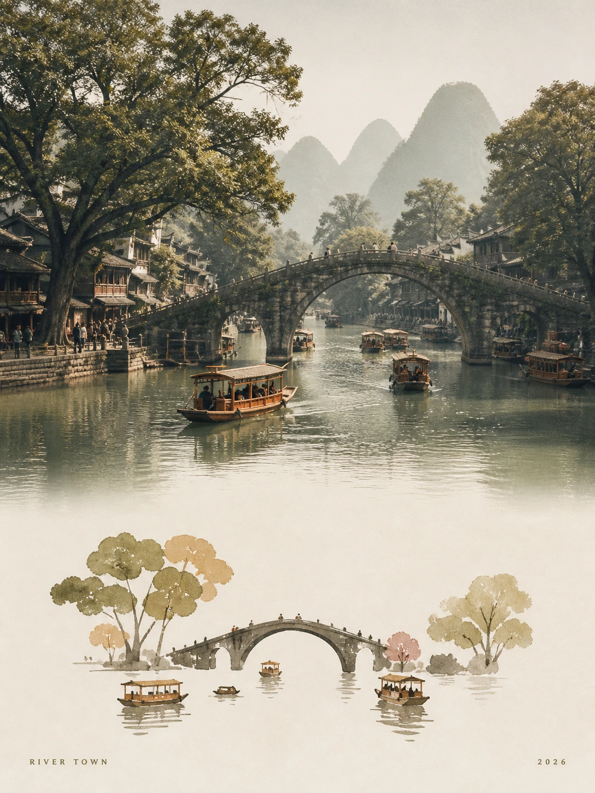

# MichengAI Photo Abstract Travel Poster

[中文](./README.md) · **English** · [Back to repository](../README.en.md)

Creates a premium travel poster from a reference photograph, with soft film-like photography above and a restrained, negative-space-led symbolic translation of the same scene below. Only tiny location and date text appears near the corners.

## Inputs

| Parameter | Required | Behavior |
| --- | --- | --- |
| `reference_image` | Yes | Each photo is edited independently while preserving subject identity, count, viewpoint, and spatial relationships. Multiple photos are never combined. |
| `location_text` | No | Used as tiny corner text. When a real place cannot be confirmed, the skill uses a generic scene label instead of inventing a city. |
| `date_text` | No | Defaults to the current calendar year. |
| `size` | No | Accepts a ratio or pixels supported by the image tool; defaults to a `3:4` request. |
| `language` | No | Controls the corner text language; defaults to the current conversation language. |

## Characteristics

- Uses warm daylight, gentle haze, soft contrast, slightly faded film color, and subtle analog grain in the upper photograph.
- Uses warm ivory paper, 1–3 scene propositions and 3–5 primary/secondary shape groups, muted earth colors, and deliberate negative space below—not a literal redraw or a miniature photo.
- Keeps both sections aligned through the same hierarchy, movement, density, directions, and visual rhythm, without tracing faces, textures, or individual source details.
- Renders only two tiny text elements: location and date. No title, slogan, logo, or watermark.
- Uses a Chinese prompt that treats the reference photo as the sole visual source; example bridges, boats, rivers, or mountains are never injected into an unrelated source image.

## Usage

```text
Use `michengai-photo-illustration-travel-poster` to turn my uploaded travel photo into a 3:4 photo-abstract travel poster.
Location text: FIELD STUDY
Date text: 2026
```

```text
Use `michengai-photo-illustration-travel-poster` to process each uploaded travel photo as a separate poster.
Size: 4:5
```

## Demos

| <strong>River town</strong><br> | <strong>Snow-peak hikers</strong><br> |
| :--- | :--- |
| <strong>Mountain monastery</strong><br> | <strong>Coastal sunset</strong><br> |
| <strong>Island flutist</strong><br> | <strong>Flower-framed dragon blood trees</strong><br> |

## Files

- [`SKILL.md`](./SKILL.md): inputs, workflow, visual constraints, and validation criteria.
- [`references/prompt-template.md`](./references/prompt-template.md): a Chinese prompt template that adapts the composition to the supplied reference photo and uses minimal graphic abstraction below.
- [`agents/openai.yaml`](./agents/openai.yaml): optional OpenAI/Codex UI metadata and default prompt.
- [`assets/demo/`](./assets/demo/): six 3:4 examples created from reference photographs.\n
