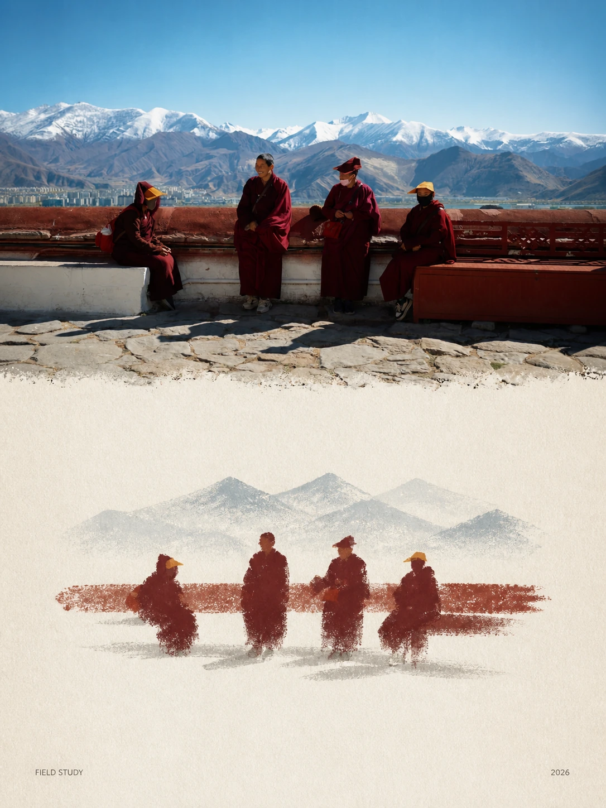
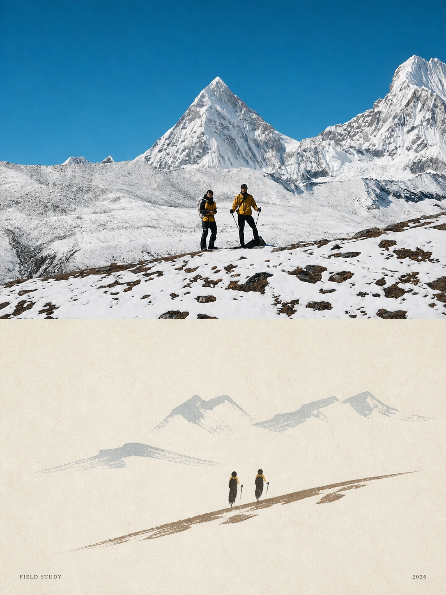
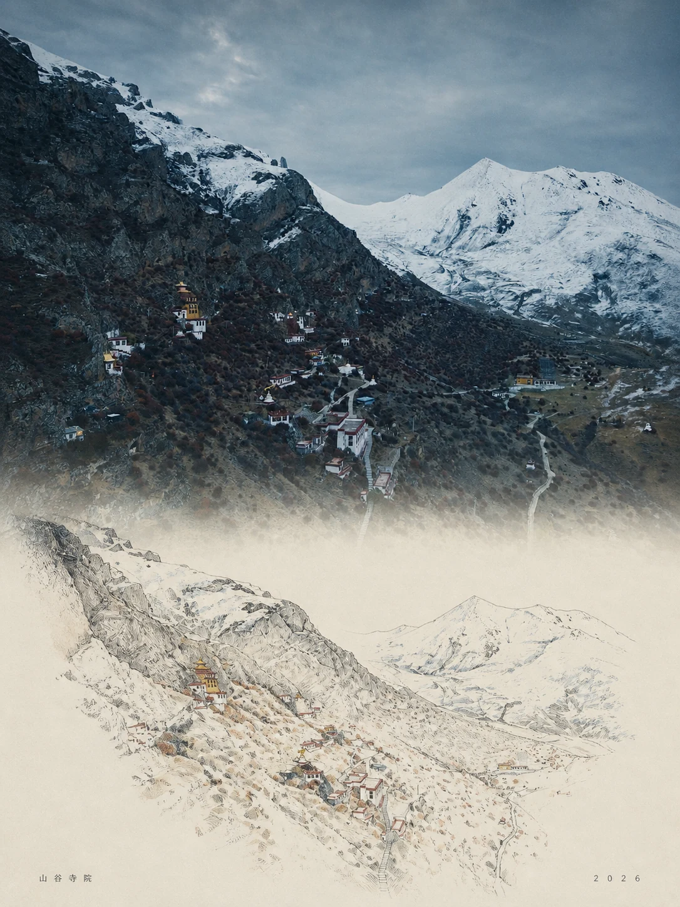
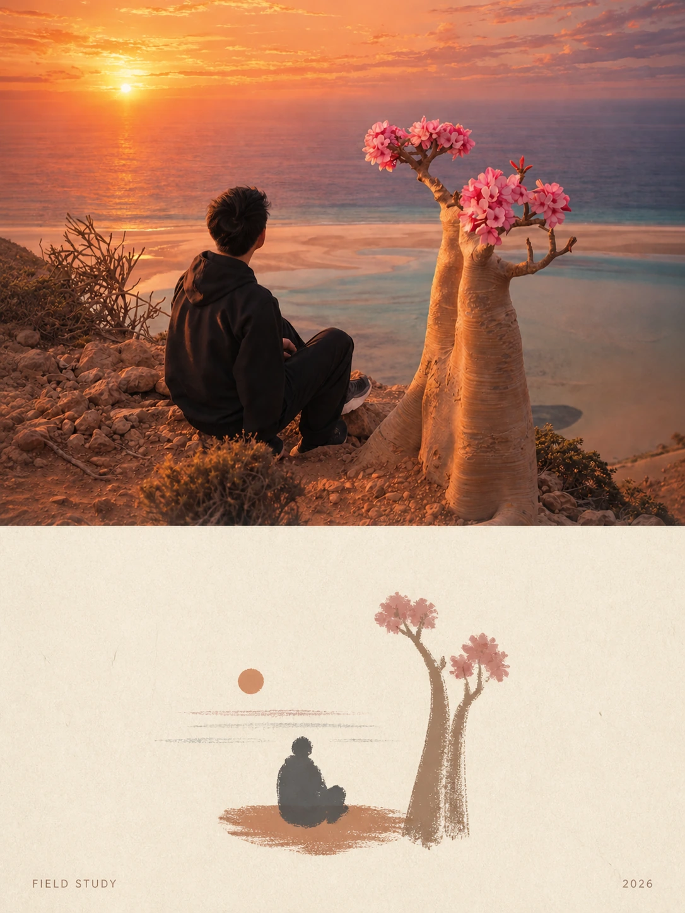
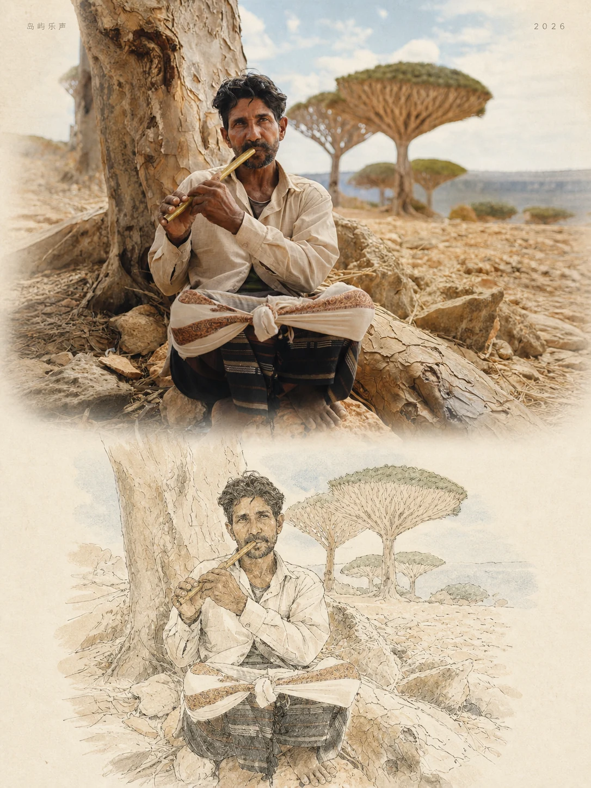
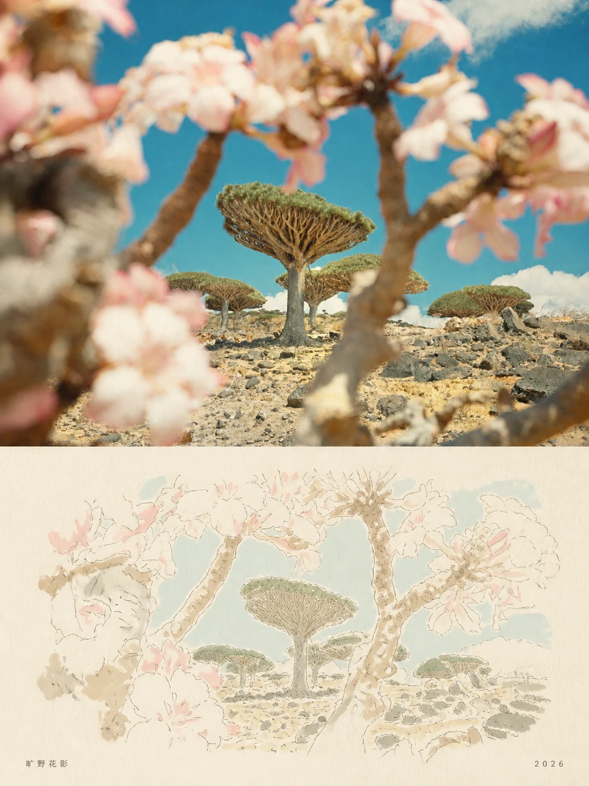

# MichengAI Photo Illustration Travel Poster

**中文** · [English](./README.en.md) · [返回仓库首页](../README.md)

生成或基于参考照片制作高级写实手绘旅行海报：上部是带柔和胶片感的真实旅行摄影，下部把同一场景转译为留白充足的极简手绘插画，只在角落保留微型地点与日期文字。

## 输入

| 参数 | 是否必填 | 规则 |
| --- | --- | --- |
| `reference_image` | 否 | 提供时逐张独立编辑并保留主体身份、数量、视角和空间关系；多张照片禁止合并。 |
| `scene` | 否 | 未提供时使用历史古镇河岸、木质观光船、石拱桥、古树与雾中喀斯特山脉。 |
| `location_text` | 否 | 用于角落地点小字；无法确认真实地点时使用通用场景名，不虚构城市。 |
| `date_text` | 否 | 未提供时使用当前公历年份。 |
| `size` | 否 | 支持比例或图像工具可接收的像素尺寸；默认请求 `3:4`。 |
| `language` | 否 | 控制角落文字语言；默认跟随当前对话语言。 |

## 特征

- 上部为温暖自然日光、轻雾、低反差、略微褪色与细腻胶片颗粒的写实旅行摄影。
- 下部使用暖象牙白纸面、稀疏线条、不完美笔触、低饱和大地色和大量负空间。
- 上下两部分保持同一场景、视角、主体位置与空间关系。
- 仅渲染地点和日期两处角落微型文字；禁止标题、口号、Logo 和水印。
- 同时支持参考照片编辑与无图场景生成；参考照片存在时优先保持照片真实性。

## 使用

```text
使用 `michengai-photo-illustration-travel-poster` 生成一张 3:4 写实手绘旅行海报。
场景：历史古镇河岸
地点文字：水乡
日期文字：2026
```

```text
使用 `michengai-photo-illustration-travel-poster` 生成一张旅行海报。
场景：安静的海边渔村与远处山脉
尺寸：4:5
```

## 演示

| <strong>高原人物</strong><br> | <strong>雪峰徒步</strong><br> |
| :--- | :--- |
| <strong>山谷寺院</strong><br> | <strong>海岸落日</strong><br> |
| <strong>岛屿乐声</strong><br> | <strong>旷野花影</strong><br> |

## 文件

- [`SKILL.md`](./SKILL.md)：输入、生成流程、视觉约束与验证标准。
- [`references/prompt-template.md`](./references/prompt-template.md)：由原始英文提示词翻译并结构化的中文生成模板。
- [`agents/openai.yaml`](./agents/openai.yaml)：可选的 OpenAI/Codex 展示元数据与默认提示。
- [`assets/demo/`](./assets/demo/)：六张由参考照片生成的 3:4 演示图。
