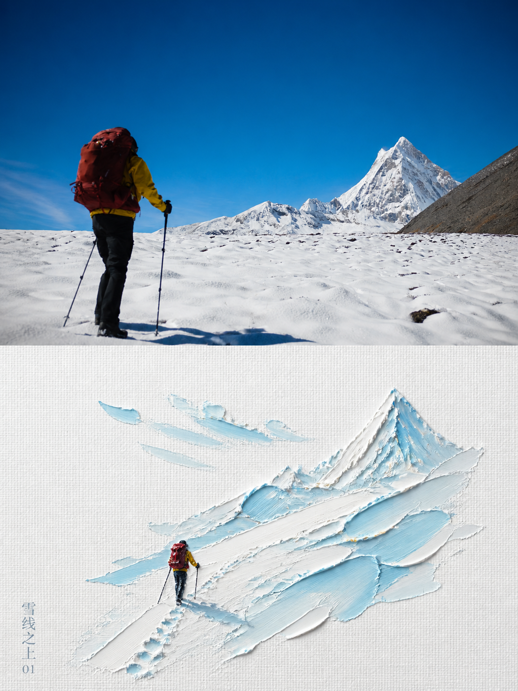
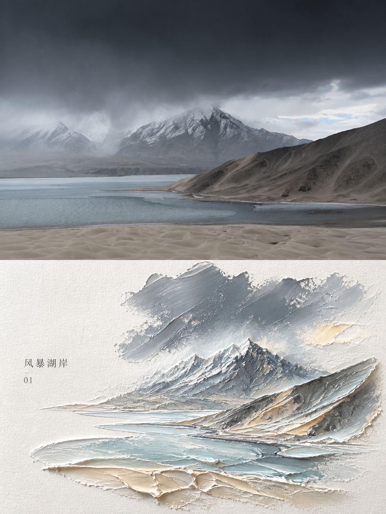
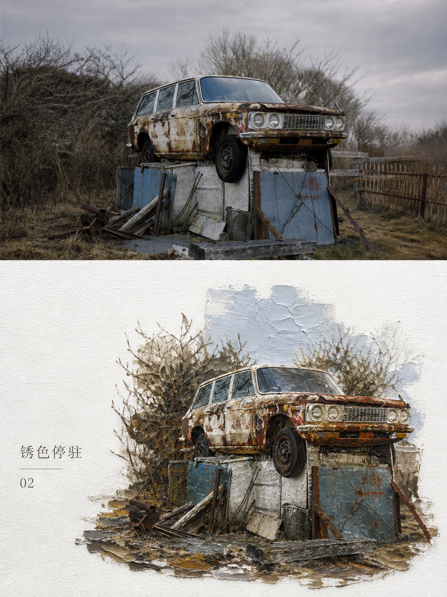
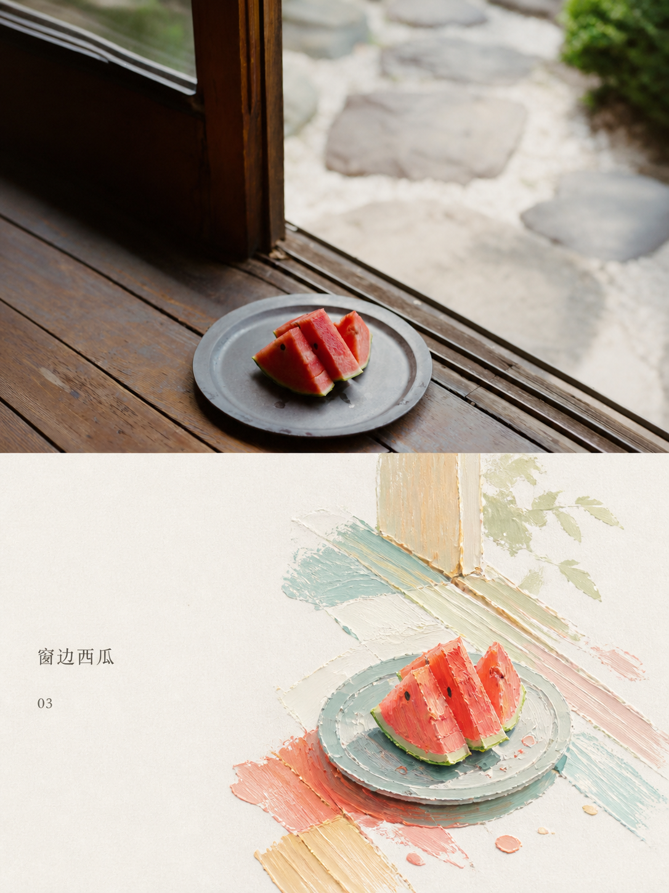
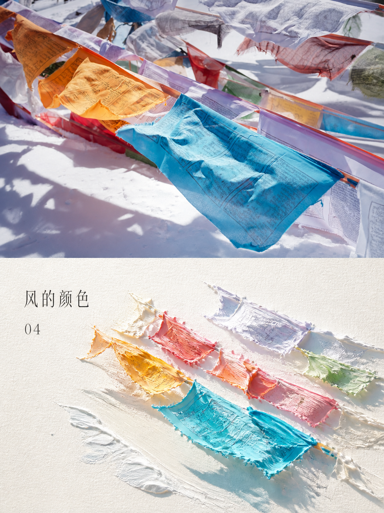
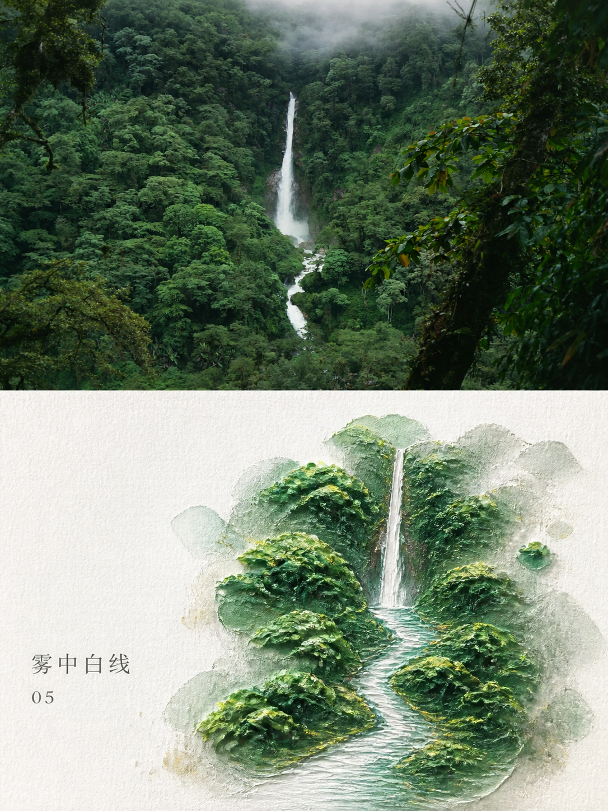

# MichengAI Photo Impasto Diorama Poster

**中文** · [English](./README.en.md) · [返回仓库首页](../README.md)

把每张参考照片分别制作成一张 `3:4` 竖版高级海报：上半部保留真实摄影，下半部在明亮纹理纸上将同一主体转译为具有颜料厚度、微缩体积和清透光感的油画微景观。两部分沿画布中线严格等高，不进行多图拼接。

## 输入

| 参数 | 是否必填 | 规则 |
| --- | --- | --- |
| `reference_image` | 是 | 每张照片独立处理，作为该成品的唯一视觉事实来源。 |
| `size` | 否 | 默认 `3:4` 竖版；其他比例仍保持上下各 50%。 |
| `title` | 否 | 未提供时从真实主体、可靠地点、情绪或象征中提炼简短标题。 |
| `subtitle` | 否 | 一行微型副文，可省略。 |
| `number` | 否 | 默认按本次输入顺序使用 `01`、`02`…… |

## 特征

- 上半部保留主体身份、比例、姿态、透视、真实材质、自然光影和原有色彩氛围，只做克制的艺术出版物级调色。
- 下半部提炼主体轮廓与叙事关系，沿居中或轻微偏心的斜向主轴组织成 3D 厚涂微景观，而不是机械复刻照片。
- 以主题色带承托主体，并根据内容选择少量倒影、波纹、光斑、影子、云层或雾气；其余区域保持大面积暖白留白。
- 从照片中挑选最明亮、清澈、有生命力的颜色重新调制，避免平均取色造成的灰脏、暗旧和莫兰迪化。
- 明显保留颜料堆积、刮刀痕、起伏边缘与纸张纤维，同时避开塑料 CG、树脂玩具、卡通和电商模型感。
- 多张照片逐张调用、逐张展示；禁止拼图、接触表或跨照片借用元素。

## 使用

```text
使用 `michengai-photo-impasto-diorama-poster` 分别处理我上传的每张照片，每张单独输出一张 3:4 海报。
```

```text
使用 `michengai-photo-impasto-diorama-poster` 处理这张照片。
标题：光影时刻
编号：01
```

## 演示

| <strong>雪线之上</strong><br> | <strong>风暴湖岸</strong><br> |
| :--- | :--- |
| <strong>锈色停驻</strong><br> | <strong>窗边西瓜</strong><br> |
| <strong>风的颜色</strong><br> | <strong>雾中白线</strong><br> |

## 文件

- [`SKILL.md`](./SKILL.md)：输入规则、构图、风格边界、文字与验收标准。
- [`references/prompt-template.md`](./references/prompt-template.md)：针对单张参考照片填写的中文图像编辑提示词模板。
- [`agents/openai.yaml`](./agents/openai.yaml)：可选的 OpenAI/Codex 展示元数据与默认提示。
- [`assets/demo/`](./assets/demo/)：六张由参考照片生成的厚涂微景观海报演示图。
