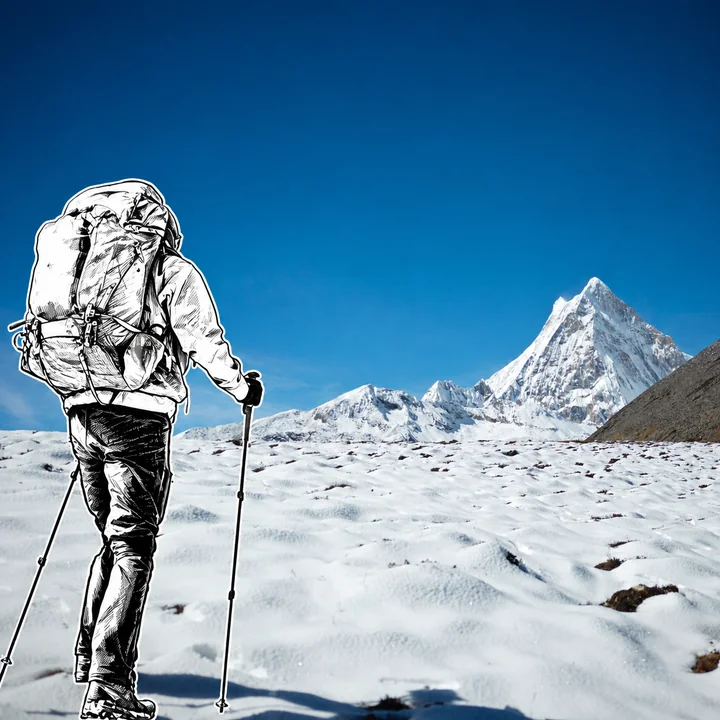
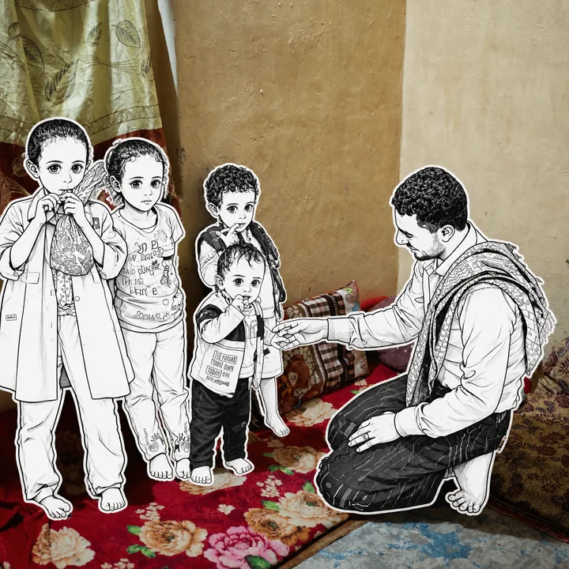
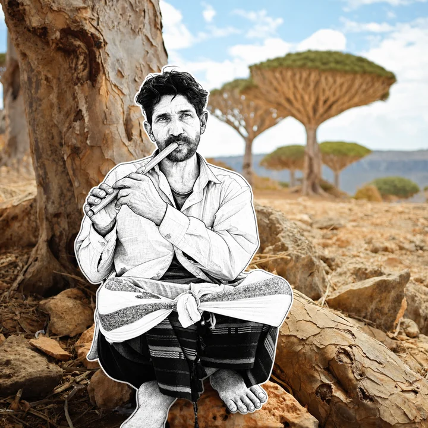
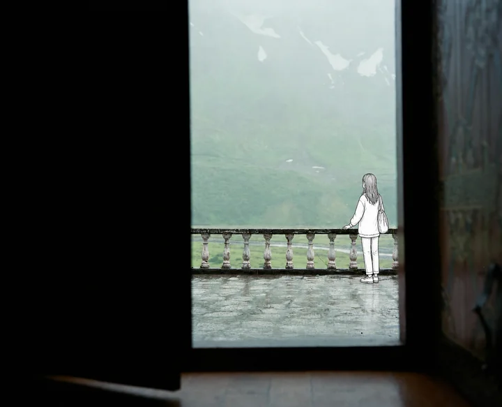

# MichengAI Photo Manga Sticker Fusion

[中文](./README.md) · **English** · [Back to repository](../README.en.md)

Turns one person or a group in a real travel, portrait, or street photograph into monochrome hand-drawn manga stickers, or inserts one naturally into an empty scene. Architecture, landmarks, perspective, lighting, color, and camera composition remain photographic; only the intended people become illustrated.

## Key characteristics

- **Fully photographic background:** preserves the source scene, aspect ratio, lens perspective, light, shadows, colors, and fine detail.
- **Monochrome character:** clean black ink, white or very light interiors, restrained black fills, and slightly imperfect hand-drawn lines.
- **Sticker silhouette:** a continuous black contour and narrow white die-cut margin surround the full character.
- **Convincing physical contact:** scale, feet, stair plane, cast shadow, and occlusion match the scene geometry.
- **Recognizable outfit:** retains visible oversized tees, jeans, jersey numbers, sneakers, shoulder bags, and accessories.
- **Complete group redraw:** when several people form the main subject, redraws them together while preserving count, relative position, height, interaction, and occlusion.
- **One output per photo:** multiple references are processed separately, never as a collage or mixed source.

## Three modes

| Mode | Use when | Behavior |
| --- | --- | --- |
| Single-person redraw | The photo has one clear main subject, or the user specifies one person | Illustrates only that person while preserving placement, pose, direction, and outfit |
| Group redraw | Two or more people jointly form the portrait or narrative subject | Redraws them together while preserving count, relative positions, interactions, and occlusion |
| Character insertion | The scene has no intended subject, or the user explicitly asks to add one | Inserts one location-appropriate manga character in a plausible foreground or middle-ground position |

## Usage

```text
Use `michengai-photo-manga-sticker-fusion` to turn the main person into a monochrome manga sticker while keeping the background completely photographic.
```

```text
Use `michengai-photo-manga-sticker-fusion` to redraw all five people in this group photo as monochrome manga stickers while preserving their count, positions, and interactions.
```

```text
Use `michengai-photo-manga-sticker-fusion` to add a black-and-white manga girl in a stadium jersey, with both feet planted on the stairs.
```

## Demos

| Snow-mountain hiker · Single-person redraw | Five-person indoor group · Group redraw |
| --- | --- |
|  |  |
| **Flute player beneath dragon blood trees · Single-person redraw** | **Rainy balcony · Character insertion** |
|  |  |

## Files

- [`SKILL.md`](./SKILL.md): input routing, edit modes, background preservation, character style, spatial integration, and acceptance checks.
- [`references/prompt-template.md`](./references/prompt-template.md): a complete Chinese image-editing prompt template filled per source photo.
- [`agents/openai.yaml`](./agents/openai.yaml): OpenAI/Codex display metadata and the default invocation prompt.
