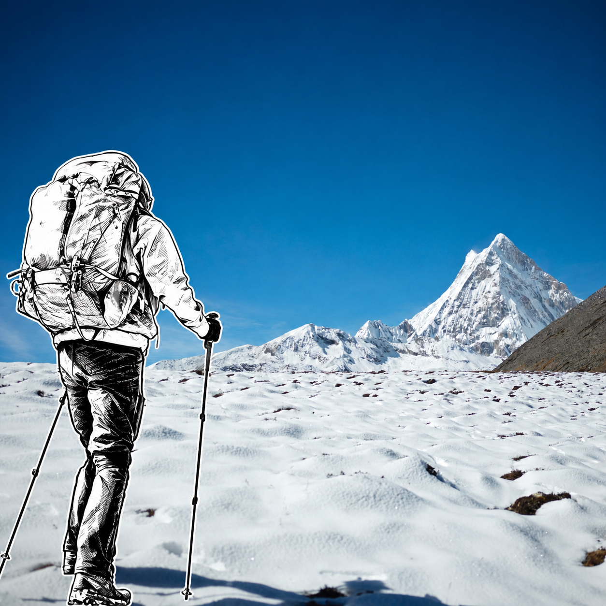
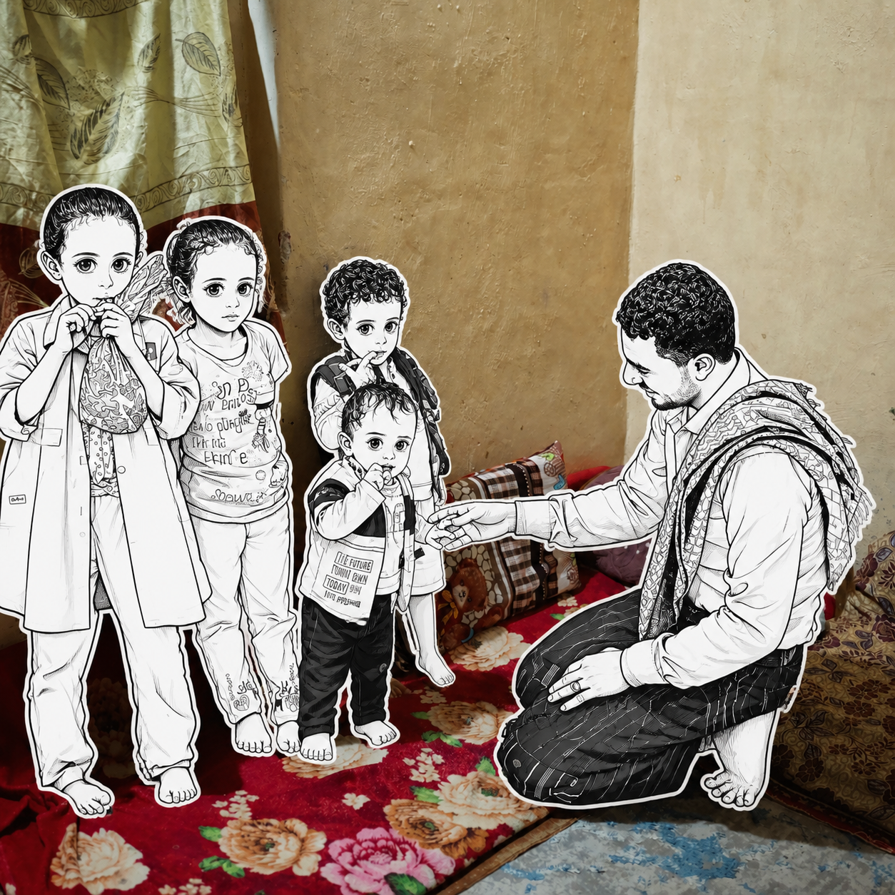
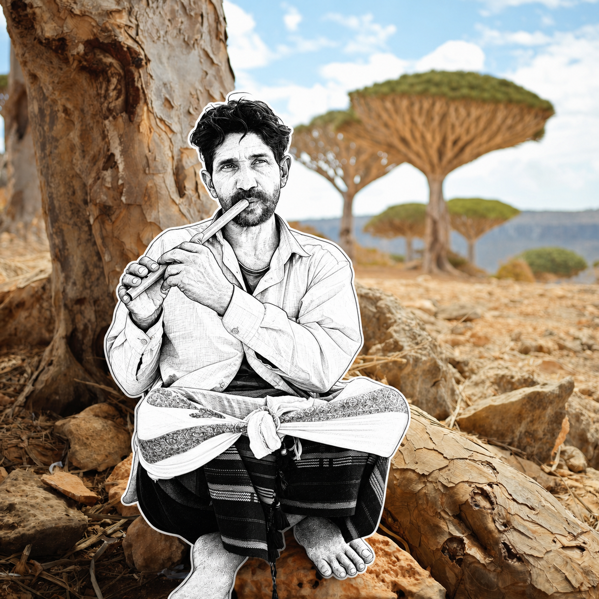
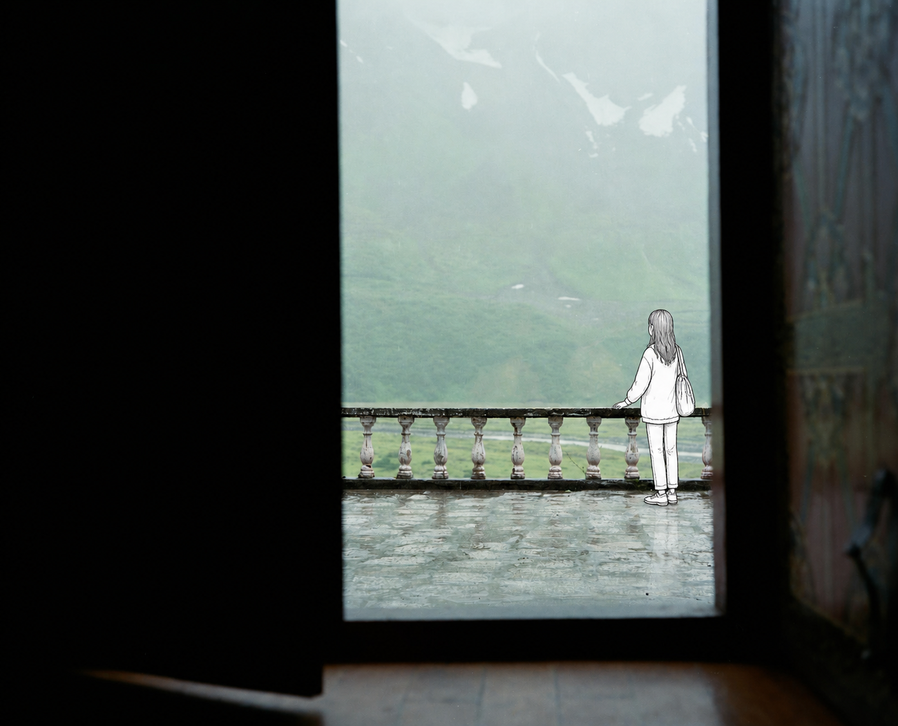

# MichengAI Photo Manga Sticker Fusion

**中文** · [English](./README.en.md) · [返回仓库首页](../README.md)

把真实旅行、合影或街拍照片中的一个人或一组人共同转化为黑白手绘漫画贴纸，也可以在无人物场景中自然置入一个黑白漫画角色。背景的建筑、地标、透视、光影、色彩和相机构图保持真实摄影，只有目标人物被插画化。

## 核心特征

- **背景完全写实**：保留原照片的场景、宽高比、镜头透视、光线、阴影、色彩和细节。
- **人物纯黑白**：干净墨线、白色或极浅内部、少量黑色块面与轻微手绘不规则感。
- **漫画贴纸轮廓**：人物全身外缘有连续黑线与窄幅白色刀模留边。
- **真实接地**：人物尺度、脚底接触、台阶平面、投影与前后遮挡符合现场空间。
- **服装可识别**：尽量保留宽松 T 恤、牛仔裤、球衣号码、运动鞋、肩背包和配饰。
- **多人完整转绘**：多人共同构成主体时默认一起转绘，严格保持人数、相对站位、身高、互动和遮挡关系。
- **逐张输出**：多张参考照片分别处理，禁止拼图和跨照片混用元素。

## 三种模式

| 模式 | 适用情况 | 行为 |
| --- | --- | --- |
| 单人转绘 | 只有一名清晰主角，或用户明确指定某一人 | 只将指定人物漫画化，保留站位、姿态、朝向和穿搭 |
| 群体转绘 | 两人或更多人物共同构成合影或叙事主体 | 默认一起转绘，保持人数、相对位置、互动和人物间遮挡 |
| 角色置入 | 场景中没有目标人物，或用户明确要求加入人物 | 在合理前景或中景加入一个与地点匹配的漫画角色 |

## 使用示例

```text
使用 `michengai-photo-manga-sticker-fusion` 把照片里的主角变成黑白漫画贴纸，背景完全保持真实。
```

```text
使用 `michengai-photo-manga-sticker-fusion` 把这张多人合影中的五个人一起转化为黑白漫画贴纸，保持人数、站位和互动不变。
```

```text
使用 `michengai-photo-manga-sticker-fusion` 在这张体育场照片的中景加入一名穿球衣的黑白漫画女孩，双脚落在台阶上。
```

## Demo

| 雪山徒步者 · 单人转绘 | 室内五人 · 群体转绘 |
| --- | --- |
|  |  |
| **树下吹笛人 · 单人转绘** | **雨雾阳台 · 角色置入** |
|  |  |

## 文件

- [`SKILL.md`](./SKILL.md)：输入判断、三种编辑模式、背景保真、人物画风、空间融合和验收规则。
- [`references/prompt-template.md`](./references/prompt-template.md)：可按照片内容填写的完整中文图片编辑提示词。
- [`agents/openai.yaml`](./agents/openai.yaml)：OpenAI/Codex 展示信息与默认调用提示。
