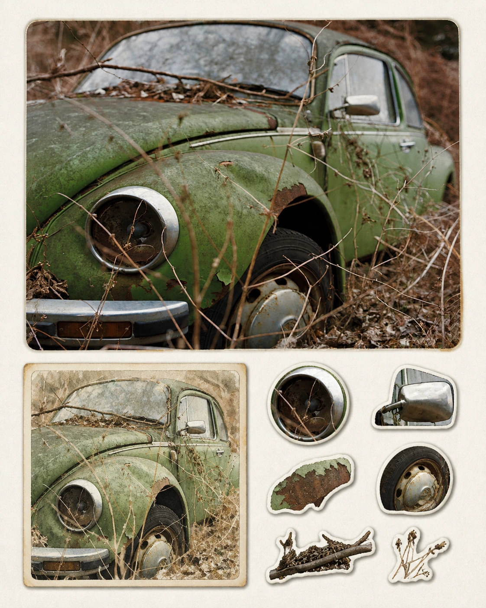
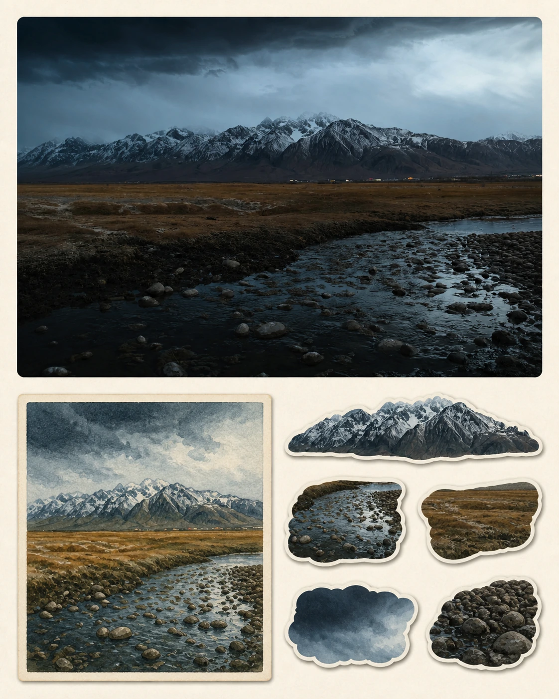
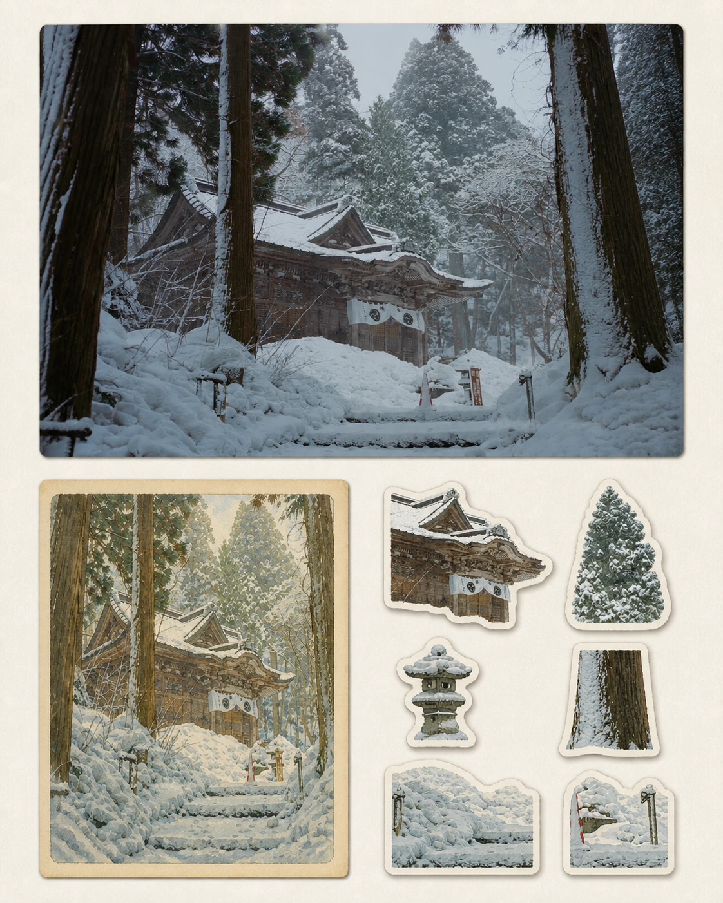
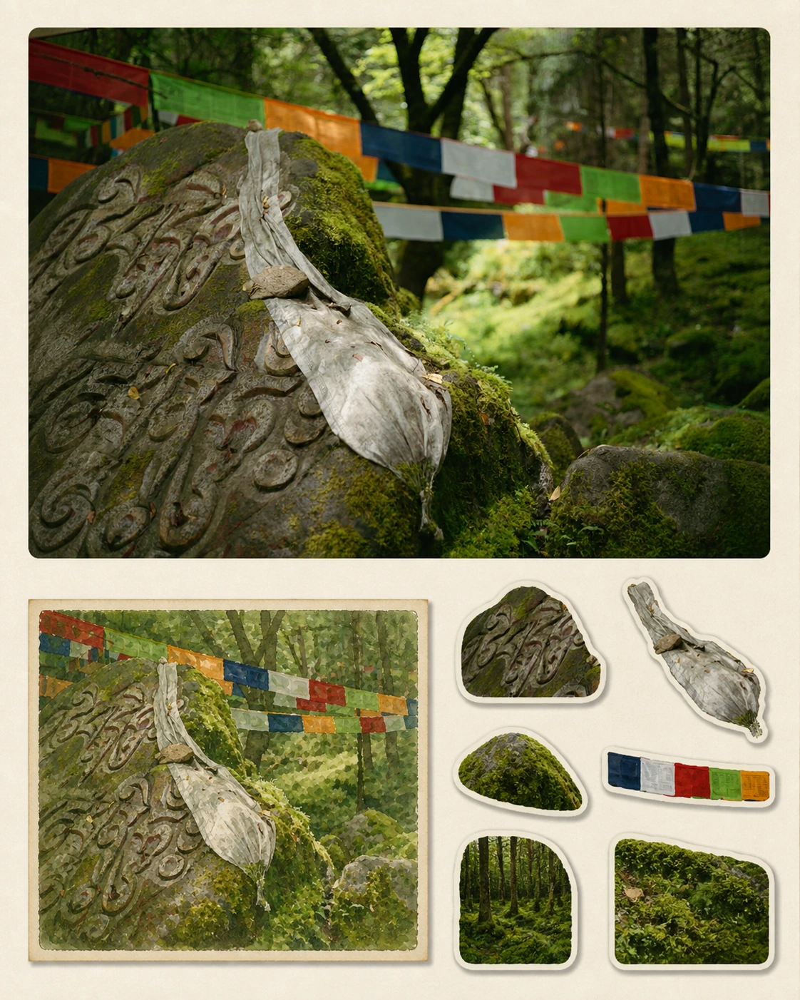
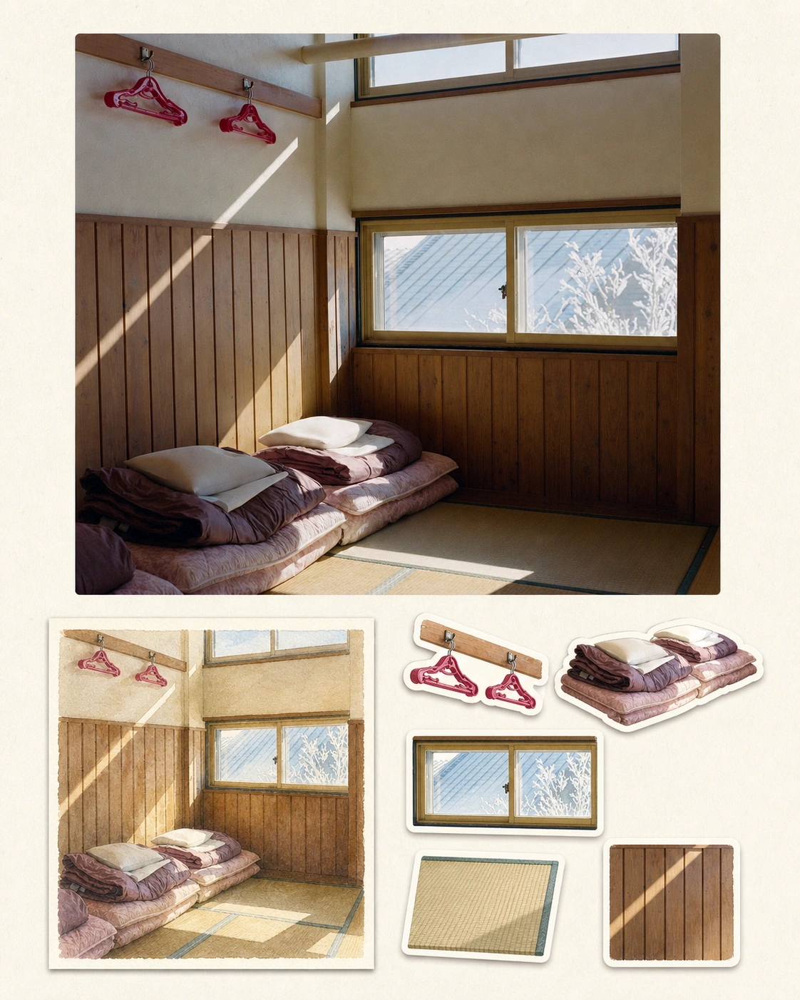
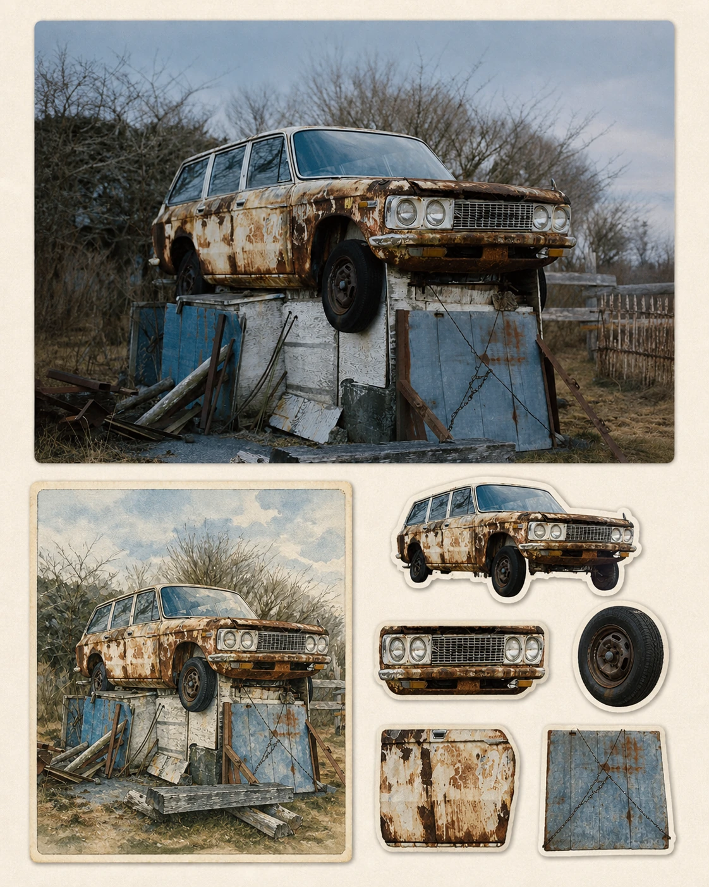

# MichengAI Photo Sticker Sheet

[中文](./README.md) · **English** · [Back to repository](../README.en.md)

Transforms an uploaded reference photo into a collectible portrait sticker sheet: a realistic hero photograph at the top, a hand-painted postcard of the same scene at lower left, and a clean set of source-derived die-cut stickers at lower right.

## Demos

| <strong>Abandoned Green Car</strong><br> | <strong>Storm Mountain River</strong><br> |
| :--- | :--- |
| <strong>Shrine in Snow</strong><br> | <strong>Moss Prayer Stone</strong><br> |
| <strong>Sunlit Tatami Room</strong><br> | <strong>Rusted Station Wagon</strong><br> |

## Visual structure

1. **Realistic hero photograph** preserves the reference subject, setting, spatial relationships, palette, lighting, and mood.
2. **Hand-painted postcard** reinterprets the same scene in watercolor, lithographic, or travel-illustration form while keeping all four edges visible.
3. **Die-cut sticker display** extracts 4–6 recognizable source elements and arranges them with warm-white borders and restrained shadows.

## Features

- Works with travel, architecture, landscape, still-life, food, product, and everyday-scene photography where the scene provides extractable elements.
- Defaults to a 4:5 portrait; adapts when the user explicitly requests another ratio.
- Processes multiple photos separately and never combines them into a collage.
- Grounds every sticker in the current source image instead of inventing unrelated objects.
- Uses a strict three-zone grid that forbids stickers from covering the postcard, overlapping, protruding, or being clipped.
- Avoids unrequested titles, random text, logos, watermarks, and phone interfaces.
- Produces the finished image with an image editing/generation tool instead of returning only a prompt.

## Usage

```text
Use the `michengai-photo-sticker-sheet` skill to turn this photo into a collectible sticker sheet.
```

For multiple photos:

```text
Use the `michengai-photo-sticker-sheet` skill on each uploaded photo. Return one separate result per photo and do not create a collage.
```

## Files

- [`SKILL.md`](./SKILL.md): input rules, workflow, strict three-zone layout, and validation requirements.
- [`references/prompt-template.md`](./references/prompt-template.md): adaptive generation template with strong boundary constraints.
- [`agents/openai.yaml`](./agents/openai.yaml): optional OpenAI/Codex integration metadata and default prompt; the core skill works independently.
- [`assets/demo/`](./assets/demo/): six generated output demos.
