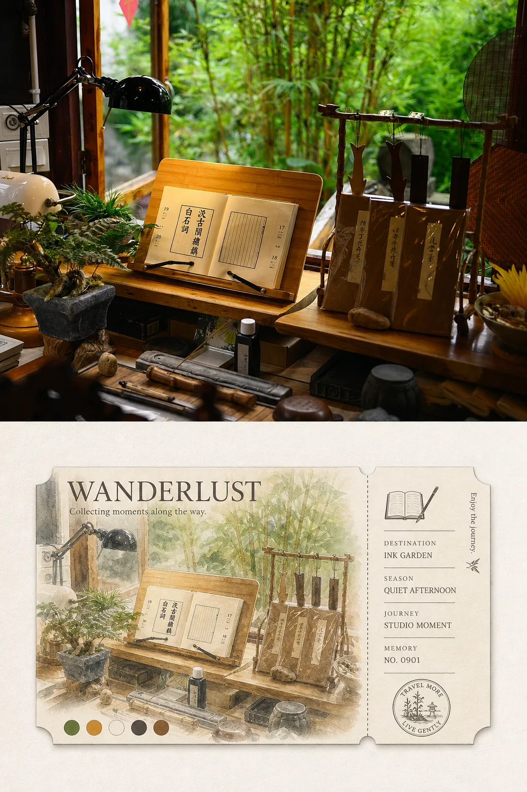
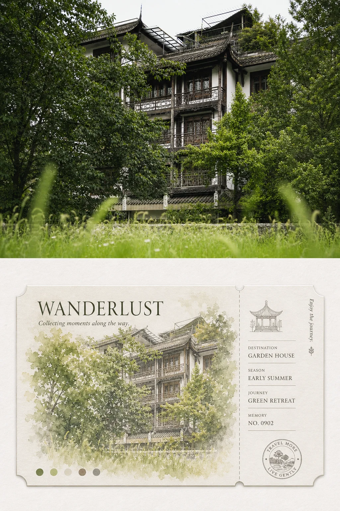
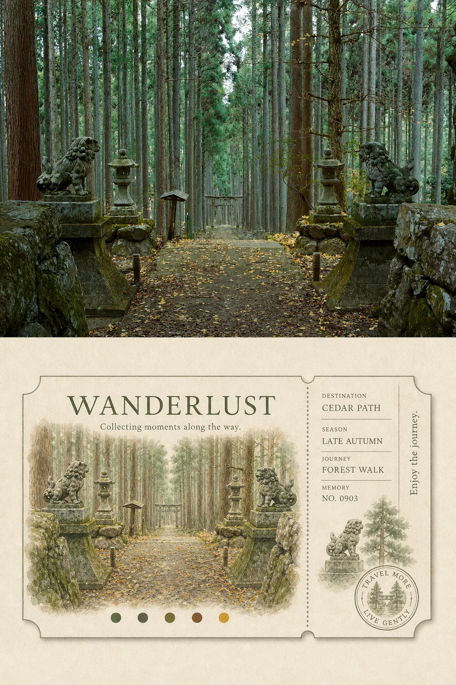
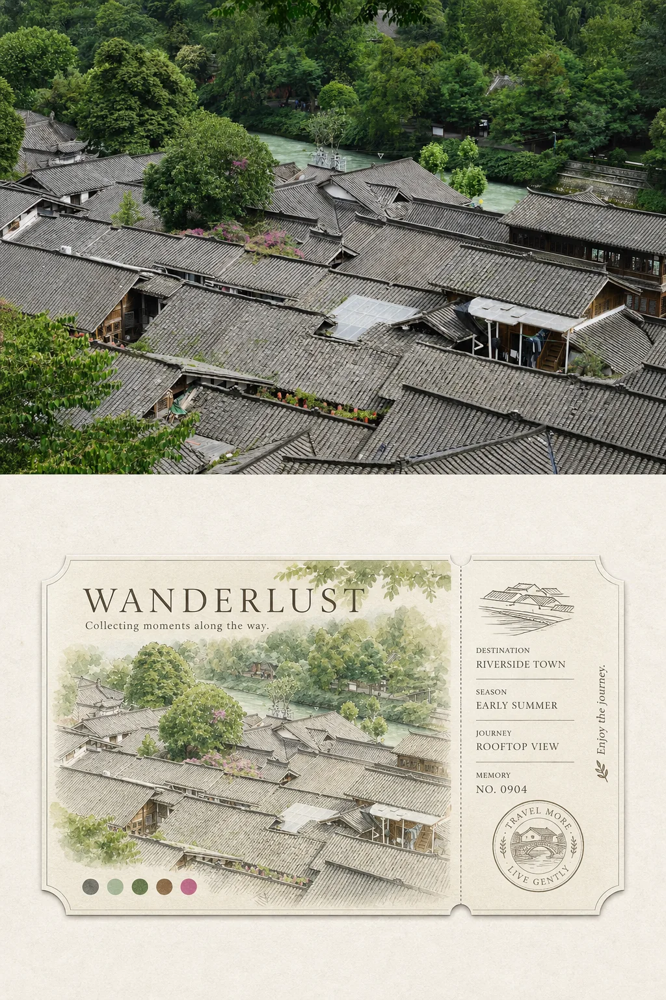
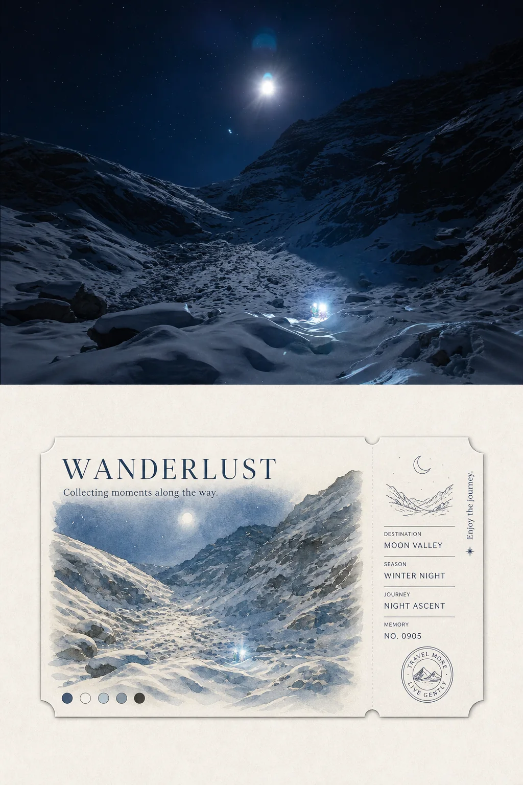
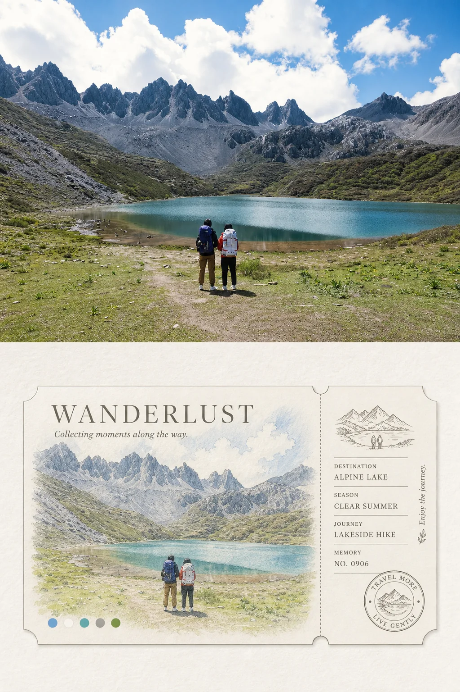

# MichengAI Photo Travel Ticket Collage

[中文](./README.md) · **English** · [Back to repository](../README.en.md)

Turns one reference photo into a portrait comparison collage: a fixed half-height authentic photograph above and a horizontal illustrated travel-ticket keepsake below, complete with structured stub, circular travel postmark, English title, and source palette dots.

## Inputs

| Parameter | Required | Behavior |
| --- | --- | --- |
| `reference_image` | Yes | Each photo is processed independently and remains the sole visual source for its output. Multiple photos are never combined. |
| `size` | No | Defaults to portrait `3:4`; other ratios retain the stacked structure. |
| `title_text` | No | Main ticket title. Defaults to `WANDERLUST` and changes only when the user explicitly supplies another title. |
| `subtitle_text` | No | One short English line beneath the title. Defaults to `Collecting moments along the way.` |
| `ticket_text` | No | May supply the four `DESTINATION`, `SEASON`, `JOURNEY`, and `MEMORY` values; otherwise the skill derives conceptual keepsake metadata from the photo. |

## Characteristics

- Locks the horizontal divider at `50%` of the canvas height so the upper and lower regions remain strictly equal. The photograph uses proportional scaling, reframing, or source-consistent extension inside the fixed upper half rather than expanding the photo zone.
- Uses an off-white, pale-grey, or warm-grey paper field below. Measured by the complete paper outline of the main ticket plus right stub, the ticket is fixed at `83% ±1%` of the canvas width and centered both horizontally and vertically within the lower half.
- Reinterprets the same scene through fresh watercolor, light colored pencil, pale wash, and literary travel-editorial illustration—not literal tracing or a photo filter.
- Uses a right-side detachable stub occupying about 20–24% of the ticket, with a scene pictogram, four label-value groups, rules, vertical travel copy, and a small motif.
- Adds a scene-derived circular travel postmark at the bottom of the stub; the main ticket uses the default series title, subtitle, and five source-color dots.
- Uses thematic wording when a real place cannot be verified. Metadata and numbers remain conceptual keepsake design rather than usable transport credentials.

## Demos

|  |  |
| --- | --- |
| <strong>Study and bamboo garden</strong><br> | <strong>Traditional house in shade</strong><br> |
| <strong>Cedar forest path</strong><br> | <strong>Riverside old-town rooftops</strong><br> |
| <strong>Moonlit snow valley</strong><br> | <strong>Alpine lake hikers</strong><br> |

## Usage

```text
Use `michengai-photo-travel-ticket-collage` to turn my uploaded travel photo into a 3:4 photo-and-ticket comparison collage.
```

```text
Use `michengai-photo-travel-ticket-collage` to process each uploaded photo separately.
Ticket metadata: DESTINATION—HIGH COUNTRY; SEASON—GOLDEN HOUR; JOURNEY—ALPINE WALK; MEMORY—NO. 0721
```

## Files

- [`SKILL.md`](./SKILL.md): input, composition, ticket-stub, illustration, typography, and validation rules.
- [`references/prompt-template.md`](./references/prompt-template.md): Chinese image-editing prompt template filled for one source photo at a time.
- [`agents/openai.yaml`](./agents/openai.yaml): optional OpenAI/Codex display metadata and default prompt.
- [`assets/demo/`](./assets/demo/): six `1024×1536` finished demos compressed as WebP.
