# MichengAI White-Space Memory Sketch

[中文](./README.md) · **English** · [Back to repository](../README.en.md)

Redraws a real photo as a contemporary Chinese paper memory page: white space participates in the composition, the main image field remains open, selected contours break out slightly, and Chinese-led marginalia adapts to each photo's palette.

## Visual structure

1. **Memory anchors** retain only 2–4 cues that establish the subject, action, and spatial relationship; photographic microdetail is deliberately merged or omitted.
2. **Compact open image field** keeps visible marks to about 25–32%, separately limits the illustration's outer footprint, and preserves at least 10–15% quiet paper margins while avoiding a centered rectangle.
3. **Controlled breakouts** let 1–3 recognizable anchors—such as a spire, branch, person, rope, water, reflection, or flower cluster—extend slightly beyond the main field.
4. **Localized color** extracts 2–4 colors from the source and confines them to the drawing.
5. **Chinese-led marginalia** defaults to one handwritten Chinese line plus a smaller English/date label, with text colors sampled from each photo rather than fixed gray and blue.

## Before and after

Each source image on the left keeps its native aspect ratio; every redraw on the right uses 3:4. These WebP previews limit source images to a 1200 px longest edge and redraws to 900 × 1200 px, with individual files at about 58–240 KiB.

| Source photo | Chinese paper memory sketch |
| --- | --- |
| **Mount Fuji and cherry blossoms**<br>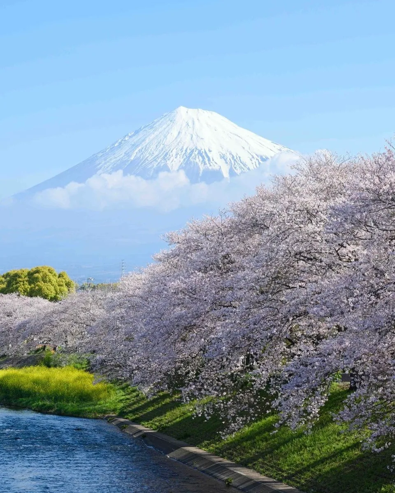 | 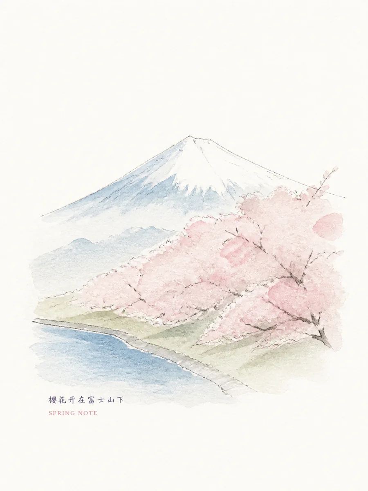 |
| **Misty twin waterfalls**<br>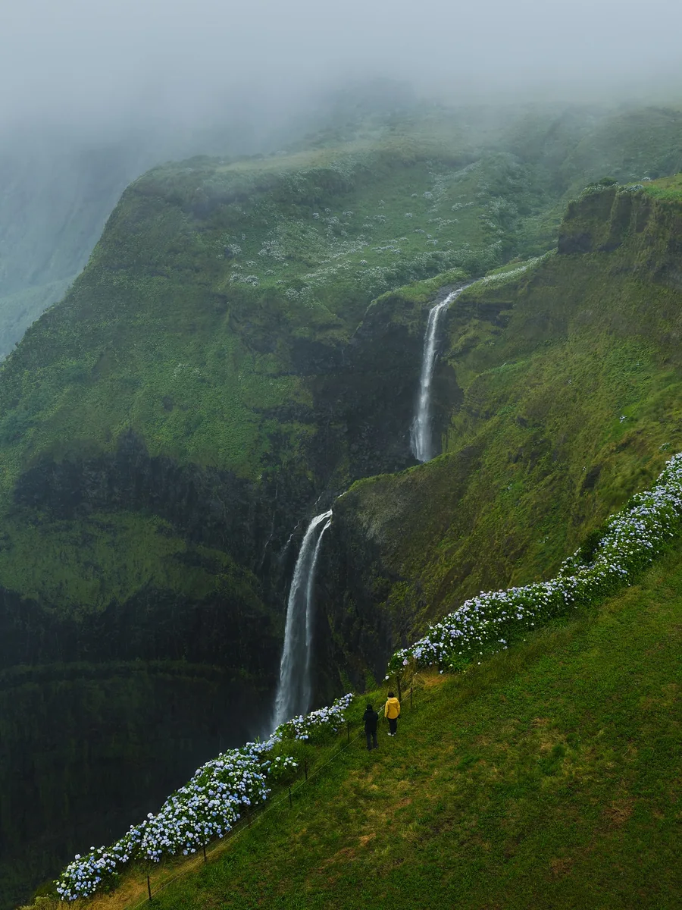 | 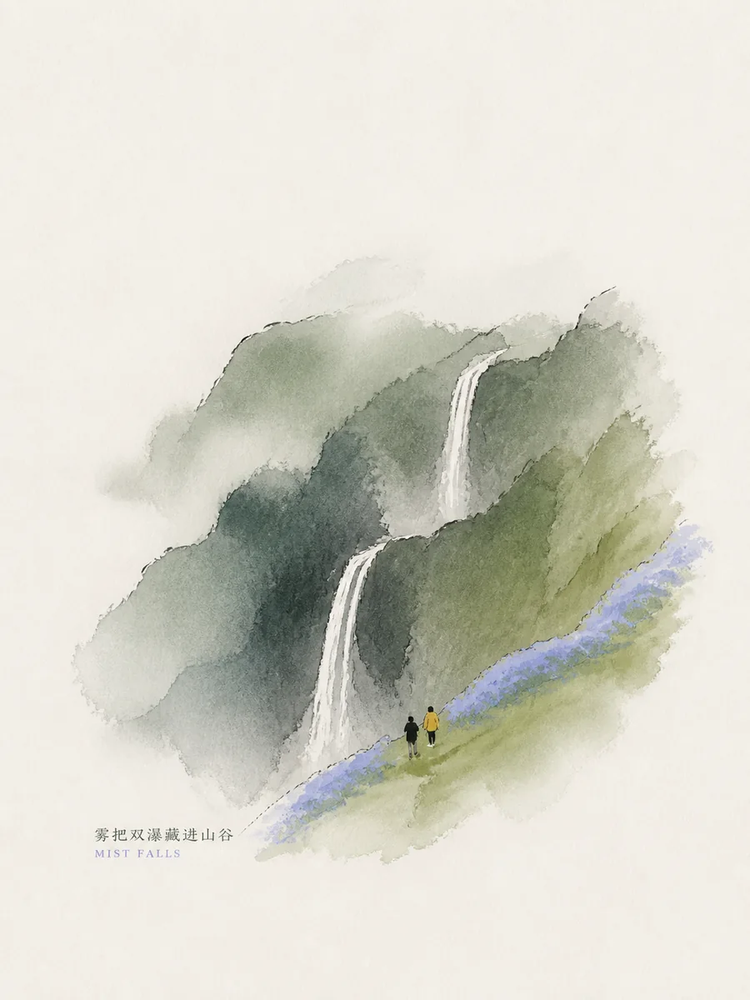 |
| **Snow climber**<br>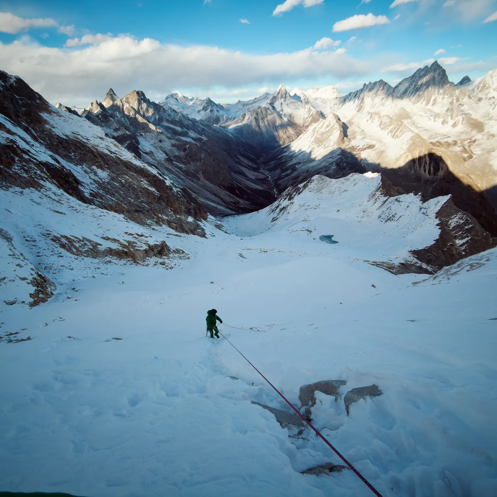 | 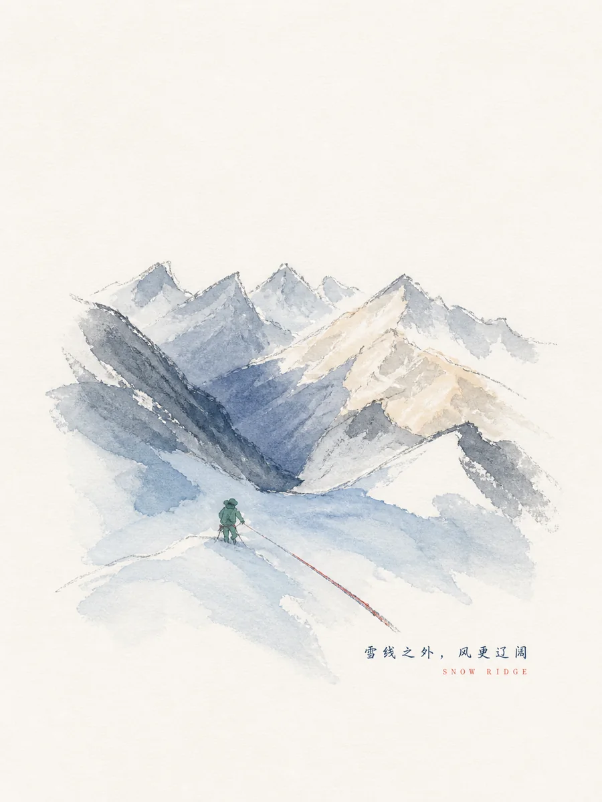 |
| **Rainforest waterfall**<br>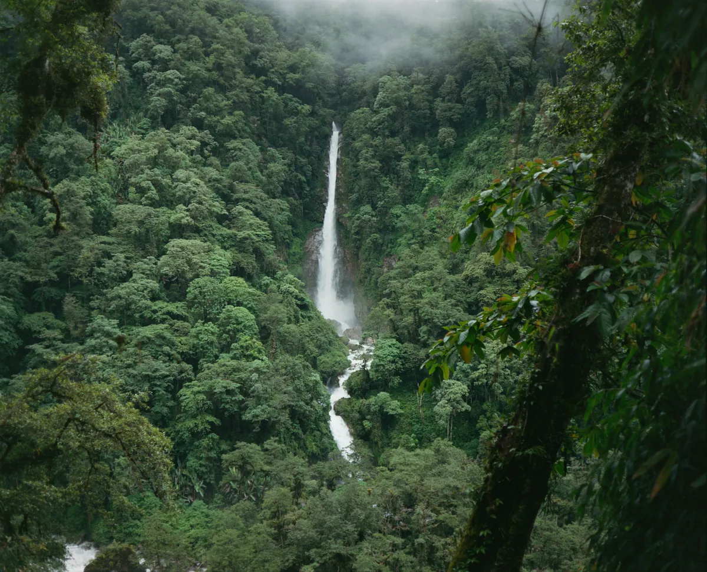 | 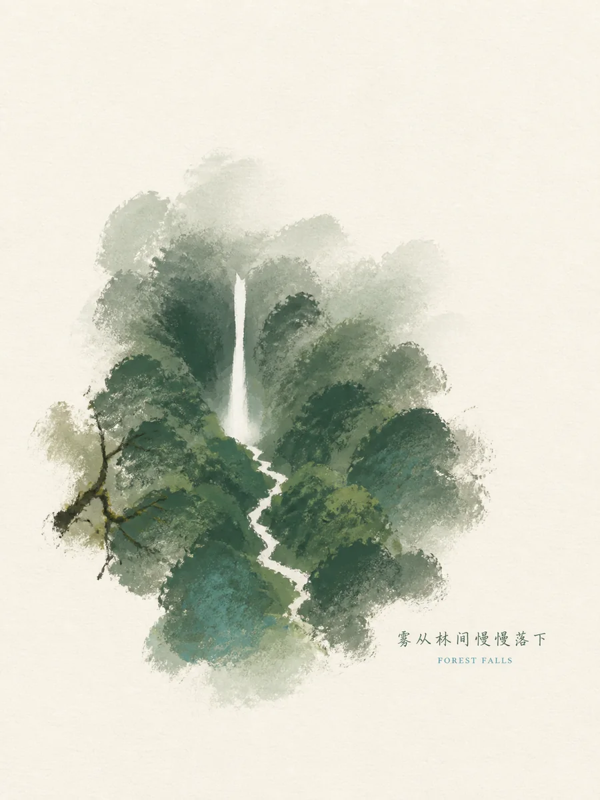 |
| **Alpine lake**<br>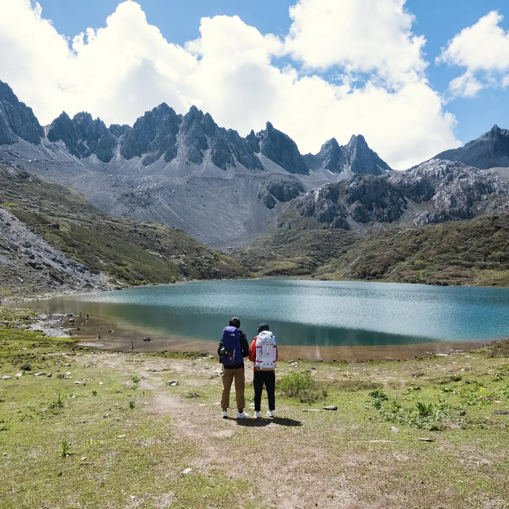 | 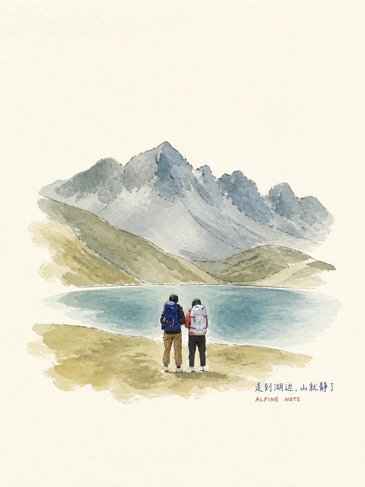 |
| **Window-side watermelon**<br>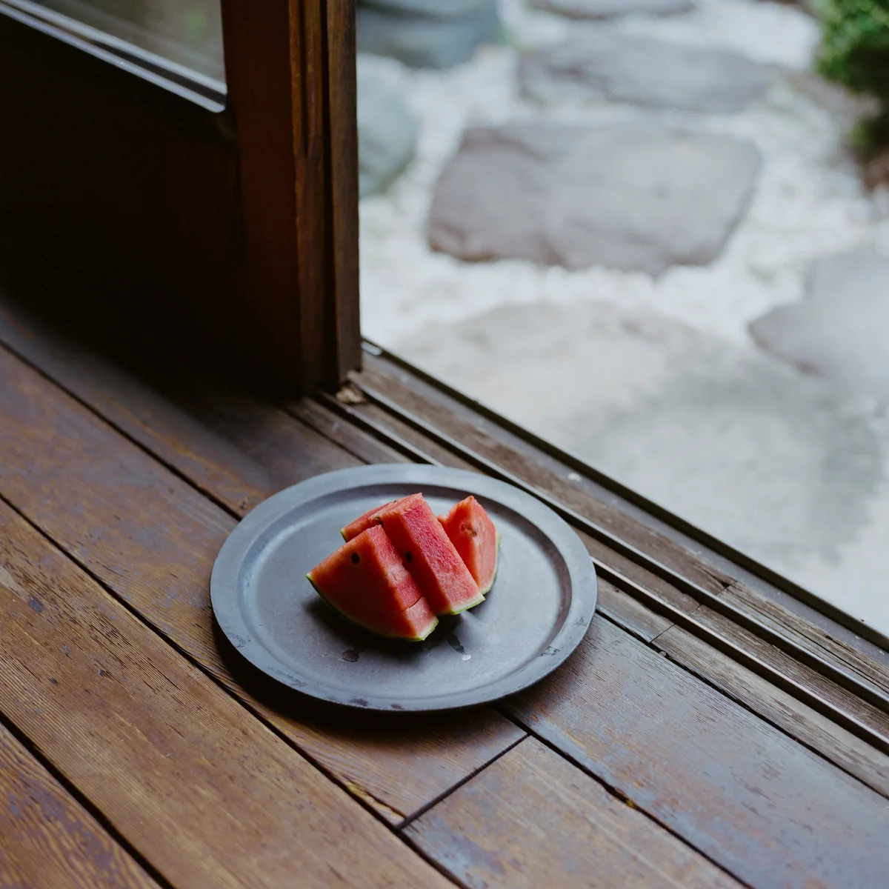 | 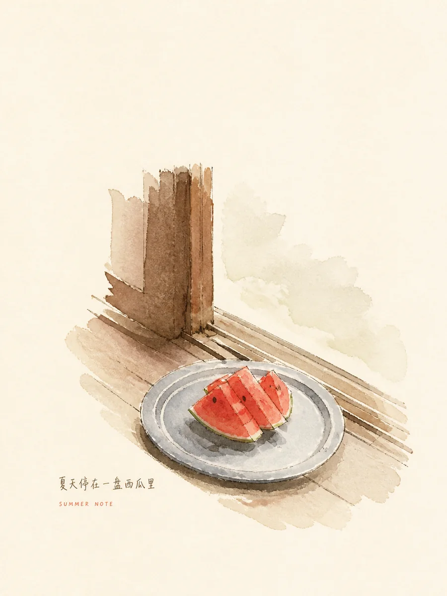 |

## Best for

- Everyday snapshots, travel fragments, pets, food, objects, windows, street corners, old shops, architecture, and landscapes.
- Photo reinterpretation that should retain recognizable subjects and spatial relationships without pixel-level restoration.
- Light, quiet, paper-led illustration with a small focal scene.

It is not intended for portrait retouching, old-photo restoration, product advertising, full-page collage, headline posters, or dense infographics.

## Usage

```text
Use `michengai-photo-white-space-memory-sketch` to redraw this photo as a 3:4 Chinese paper memory page. Preserve the person's pose, window frame, and slanting afternoon light; let one contour break out slightly and adapt the marginalia colors to the photo.
```

With a marginal note:

```text
Use `michengai-photo-white-space-memory-sketch` on this photo. Render the tiny Chinese note “风在旧窗边停了一会儿” and the archive label “08.30 / HOME”.
```

For multiple photos:

```text
Process each uploaded photo separately and return one 3:4 white-space memory sketch per photo. Do not make a collage.
```

## Files

- [`SKILL.md`](./SKILL.md): execution workflow, visual boundaries, and acceptance criteria.
- [`references/prompt-template.md`](./references/prompt-template.md): adaptive Chinese generation prompt and focused correction clauses.
- [`agents/openai.yaml`](./agents/openai.yaml): optional OpenAI/Codex metadata and Chinese default prompt.
- [`assets/demo/`](./assets/demo/): compressed source-ratio comparisons and 3:4 redraw previews.
