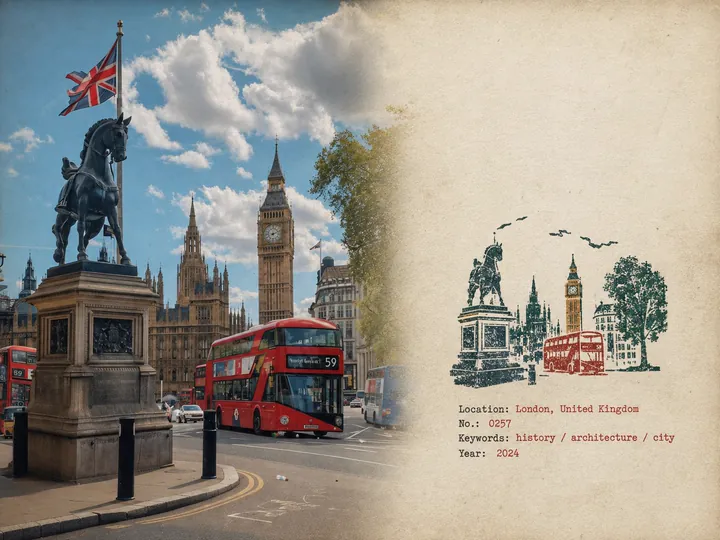
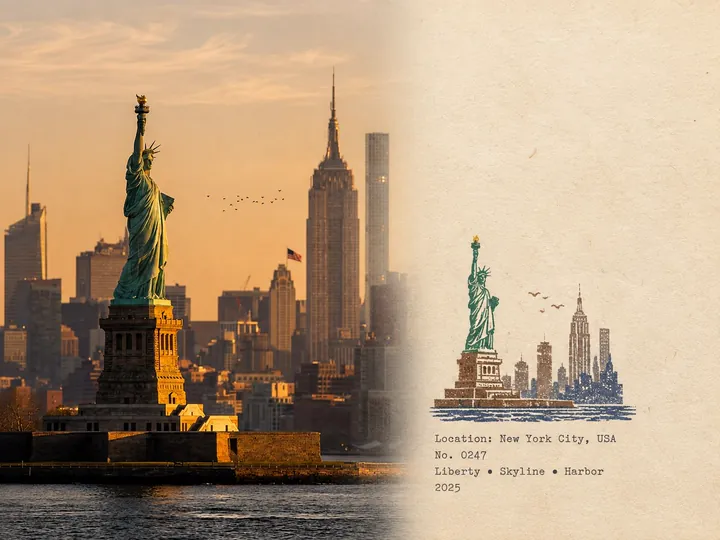
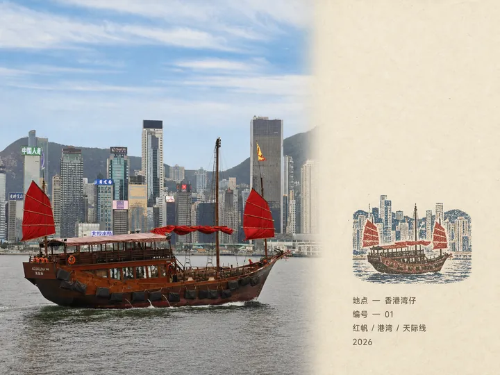
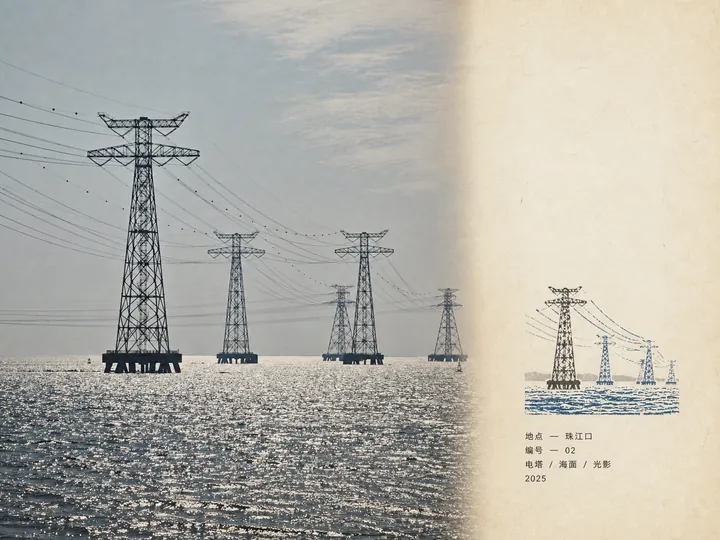
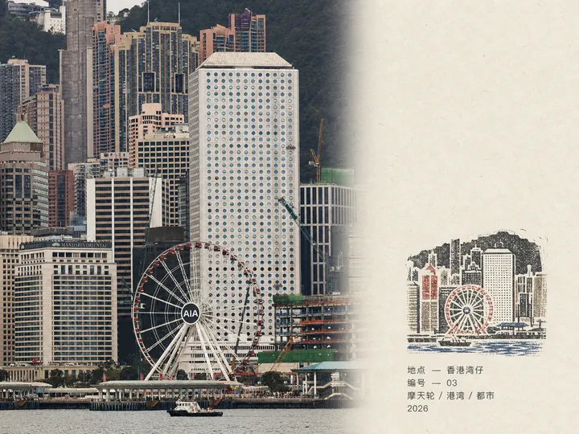

# MichengAI Rubber Stamp Field Notes

[中文](./README.md) · **English** · [Back to repository](../README.en.md)

Turns each travel photo into a separate, quiet, collectible 4:3 field-note poster. The authentic photograph remains on the left, while an aged-paper area on the right contains generous whitespace, a small handmade multi-color rubber stamp, and minimal localized archival text.

## Core rules

- Generate one independent result per photo. Never create a collage, combined-location design, or contact sheet.
- The photograph occupies roughly 58% of the frame and preserves the original subject, perspective, light, texture, and atmosphere.
- The aged-paper area occupies roughly 42% and uses subtle paper fibers, faint handling marks, and large unprinted areas.
- The rubber stamp sits in the lower-middle paper area and occupies roughly 30–38% of the right section's height.
- The stamp keeps only a few location-defining silhouettes and uses 2–4 muted spot colors sampled from the photograph.
- The impression retains believable uneven pressure, broken contours, dry ink, grain, and slight color-layer misregistration without looking digitally distressed.

## Archival text

The right side contains only four field lines:

- the correct location name;
- a number;
- exactly three short keywords;
- the Gregorian calendar year.

The skill follows an explicitly requested language or, when none is specified, the current conversation language. Chinese uses accurate Chinese text with labels such as `地点` and `编号`; English uses `LOCATION` and `NO.` with English keywords. When the location cannot be identified reliably, the skill asks the user instead of guessing.

## Usage

```text
Use $michengai-rubber-stamp-field-notes to process each uploaded travel photo separately.
Use Chinese copy, start numbering at 01, use the year 2026, and never create a collage.
```

## Demos

The five tested results below are compressed to **720 × 540 WebP** and constrained to 360px wide in this README to balance page loading and text legibility.

| London · Westminster | New York · Statue of Liberty |
| --- | --- |
|  |  |
| Hong Kong Wan Chai · Red Sails | Pearl River Estuary · Power Pylons |
|  |  |

**Hong Kong Wan Chai · Ferris Wheel**

<p align="center"></p>

## Files

- [`SKILL.md`](./SKILL.md): per-photo workflow, language behavior, layout ratios, and rubber-stamp constraints.
- [`references/prompt-template.md`](./references/prompt-template.md): adaptive image-generation template.
- [`agents/openai.yaml`](./agents/openai.yaml): Codex display metadata and default invocation.

> This style does not have a demo image yet. Future tested outputs can be stored under `assets/demo/` in this child skill.
