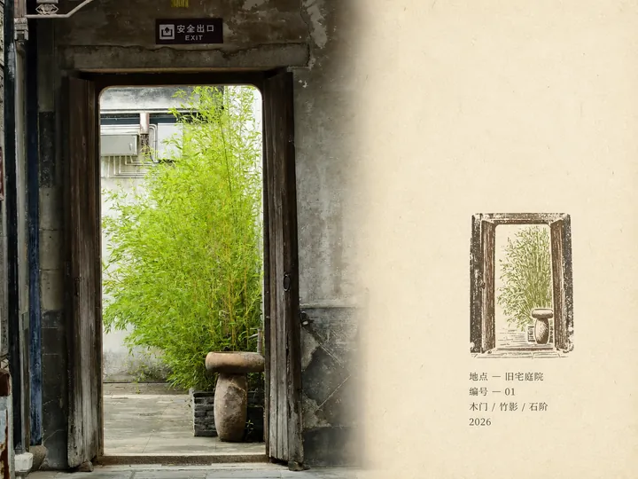

# MichengAI Rubber Stamp Field Notes

**中文** · [English](./README.en.md) · [返回仓库首页](../README.md)

将每张旅行照片分别制作成安静、自然、可收藏的 4:3 横版田野笔记海报：左侧保留真实照片，右侧使用留白充足的旧纸、小型多色手工橡皮章和少量随对话语言本地化的档案文字。

## 核心规则

- 每张照片单独生成一个结果，禁止拼图、合并地点或制作接触表。
- 左侧照片约占 58%，保持主体、透视、光线、纹理和现场氛围。
- 右侧旧纸约占 42%，使用自然纸纤维、轻微翻阅痕迹和大片未印刷留白。
- 橡皮章位于纸面的中下部，高度约占右侧区域的 30–38%。
- 橡皮章只保留少量识别性轮廓，使用从照片提取的 2–4 个低饱和专色。
- 印迹保留轻微压力不均、断线、漏墨、颗粒和套色偏移，避免数字矢量感。

## 档案文字

右侧只生成四行字段：

- 地点的正确名称；
- 编号；
- 恰好三个简短关键词；
- 公历年份。

Skill 会遵循用户明确指定的语言；未指定时使用当前对话语言。中文会使用“地点”“编号”和准确的中文关键词，英文则使用“LOCATION”“NO.”及英文关键词。无法可靠判断地点时，Skill 会先询问用户，不会擅自猜测。

## 使用

```text
使用 $michengai-rubber-stamp-field-notes 分别处理我上传的旅行照片。
文案使用中文，编号从 01 开始，年份使用 2026；每张照片单独输出，不要拼图。
```

## 演示

以下 6 个实测结果均已压缩为 **720 × 540 WebP**，并在 README 中限制为 360px 宽，兼顾页面加载和文字可读性。

| 伦敦・威斯敏斯特 | 纽约・自由女神像 |
| --- | --- |
|  |  |
| 香港湾仔・红帆 | 珠江口・海上电塔 |
|  |  |

| 香港湾仔・摩天轮 | 旧宅庭院・竹影 |
|  |  |

## 文件

- [`SKILL.md`](./SKILL.md)：逐图处理流程、语言规则、画面比例和橡皮章约束。
- [`references/prompt-template.md`](./references/prompt-template.md)：自适应图片生成模板。
- [`agents/openai.yaml`](./agents/openai.yaml)：Codex 展示名称和默认调用提示。

> 演示图存放于本目录的 `assets/demo/`，后续实测结果可继续补充。
